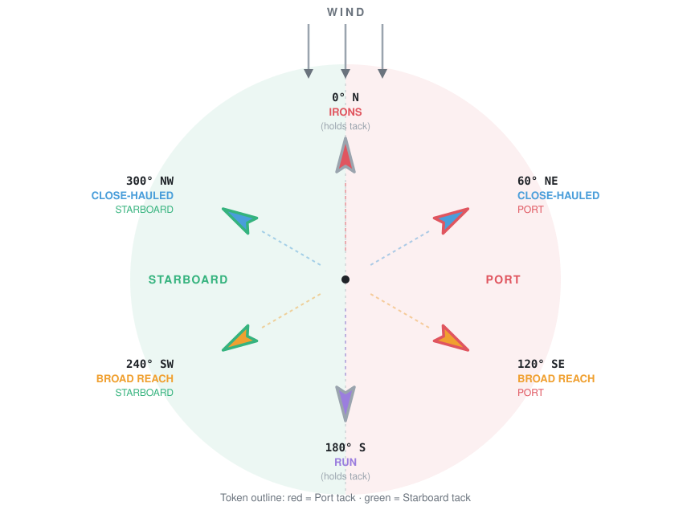
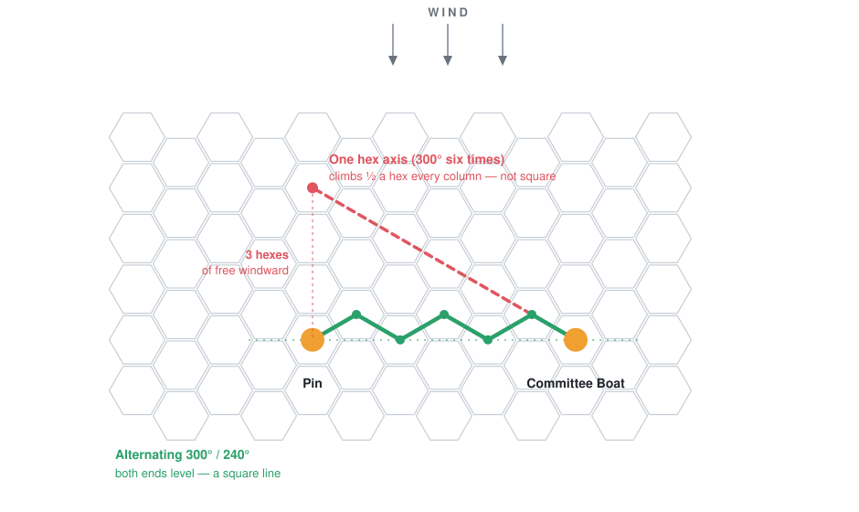
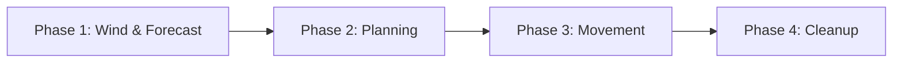

# ⛵ Cardboard Regatta: Official Rulebook


## Table of Contents
- [🏁 **Start Here: Your First Race**](#-start-here-your-first-race) — *new players read this first*
- [Components & Core Concepts](#components--core-concepts)
  - [Components](#components)
  - [Points of Sail & Hex Geometry](#points-of-sail--hex-geometry)
- [Setup & Course Layout](#setup--course-layout)
  - [Race Setup](#race-setup)
  - [Starting Line Layout](#starting-line-layout-laying-a-square-line)
  - [Sailing Instructions](#sailing-instructions-sailing-the-course)
  - [Example Courses](#example-courses)
  - [Fast-Play / Quick-Start Rules](#fast-play--quick-start-rules-sprint)
- [Turn Structure & Gameplay Phases](#turn-structure--gameplay-phases)
  - [Pre-Start Sequence](#pre-start-sequence-turns--3--2--1)
  - [Phase 1: Wind & Forecast Phase](#phase-1-wind--forecast-phase) — **[2d6 Wind Shift Table](#2d6-global-wind-shift-table)**
  - [Phase 2: Planning Phase](#phase-2-planning-phase) — **[Actions Summary](#actions-summary)**
  - [Phase 3: Movement Phase](#phase-3-movement-phase) — **[Upwind Rank](#reading-upwind-rank)** · **[Initiative](#initiative)** · **[Momentum Limits](#point-of-sail-momentum-limits)**
  - [Phase 4: Cleanup Phase](#phase-4-cleanup-phase)
- [Sailing Tactics & Hazards](#sailing-tactics--hazards)
  - [Wind Shadow](#wind-shadow)
  - [Rounding Marks](#rounding-marks) — **[When Have You Rounded?](#when-have-you-rounded)**
  - [Fouling & Right-of-Way (ROW) Rules](#fouling--right-of-way-row-rules)
    - [Rules We Did Not Implement](#rules-we-did-not-implement)
    - [The Bail Out](#-the-bail-out-declining-a-collision)
- [Protests & Penalties](#protests--penalties)
  - [Incurring a Protest Card](#incurring-a-protest-card)
  - [Clearing a Protest](#clearing-a-protest)
  - [No Disqualification (Never DSQ)](#no-disqualification-never-dsq)
- [Finishing the Race](#finishing-the-race)
  - [The Finishing Window](#the-finishing-window)
- [Scoring System (RRS Appendix A)](#scoring-system-rrs-appendix-a)
- [📐 Worked Examples](#-worked-examples)
- [⛵ For Sailors: What Translated, and How](#-for-sailors-what-translated-and-how)
- [Definitions](#definitions)

---

## 🏁 Start Here: Your First Race
> *Read this chapter, play one race, then read the rest. Everything below this section is reference — you do not need it to start.*

### The Whole Game in Four Sentences
You are racing sailboats around a course of buoys, and the first boat home wins. Each round you secretly programme a handful of **action cards**, then everyone reveals and moves one card at a time. How many cards you get is your **Momentum** — so speed is not just distance, it is *how much you get to do*. The wind shifts, boats steal each other's breeze, and running into somebody costs you a penalty.

### Three Things That Decide Everything

> [!IMPORTANT]
> **1. You cannot sail towards the wind.** Point straight at it and you are in [Irons](#term-irons) — stopped and helpless. To reach anything upwind you must **[zigzag](#points-of-sail--hex-geometry)**. Your first race has the mark dead upwind precisely so you learn this.
>
> **2. Momentum is your action count.** Momentum 4 means four cards and up to four hexes. Momentum 1 means one. [`Trim`](#term-trim) builds it — but the Momentum you gain this round buys cards *next* round.
>
> **3. Your heading alone sets your [Point of Sail](#term-points-of-sail) and your tack.** Both are just your facing measured against the wind — so **when the wind shifts, they change without you doing anything.** That is the whole tactical game.

### Set Up a Sprint
1. Use **[Course 1: Beginner Sprint](#-course-1-beginner-sprint-2-legs--1520-mins)** — one mark, 4 hexes straight upwind of the middle of the start line, then straight back down to finish.
2. Use the **[Fast-Play rules](#fast-play--quick-start-rules-sprint)**: skip the pre-start countdown entirely. Everyone places a boat in the [Starting Berths](#term-starting-berth), sets Momentum to **2**, and the gun fires immediately on Round 1.
3. Wind blows from the **North**, straight down the board.

### One Complete Round, Worked
Two boats. **Red Pearl** faces **300° (NW)** and **Blue Horizon** faces **60° (NE)** — both [Close-Hauled](#term-close-hauled), the closest either can point to the wind. Red Pearl is on [Starboard](#term-starboard) tack, Blue Horizon on [Port](#term-port). Both start at Momentum 2, level with each other in the berths.

**[Phase 1 — Wind & Forecast](#phase-1-wind--forecast-phase)** *(six steps, in order)*

| Step | What happens |
|:---:|---|
| 1 | **Wind arrives** — still from the North. No change. |
| 2 | **Irons bleed** — neither boat is head to wind. Nothing. |
| 3 | **Puff** — none this round. Nothing. |
| 4 | **Shadow** — neither boat sits in the other's cone. Nothing. |
| 5 | **Settle** — both at Momentum 2, both capped at 4. Nobody is over. Nothing. |
| 6 | **Forecast** — roll 2d6 → **11, Shift Right**. The Forecast Marker goes to 60°. |

> **Read that forecast.** Next round the wind comes from 60°. Red Pearl (facing 300°) will become a [Broad Reach](#term-broad-reach) — **[lifted](#term-lift)**, and faster. Blue Horizon (facing 60°) will be pointing straight into it — **[Irons](#term-irons)**. She has one round to do something about it.

**[Phase 2 — Planning](#phase-2-planning-phase)** — Momentum 2 gives each boat **2 cards**.

- **Red Pearl** is already on the tack the shift will lift. She plays `Trim`, `Trim`.
- **Blue Horizon** must escape the header. She plays `Tack`, `Trim`.

**[Phase 3 — Movement](#phase-3-movement-phase)** — both boats are level and both have Momentum 2, so the tie goes to the **1d6 rolled once and kept all round**. Red Pearl rolls 5, Blue Horizon 3 — Red Pearl acts first at every step.

| | Red Pearl | Blue Horizon |
|---|---|---|
| **Step 1** | `Trim` — sails 1 hex NW across the line. **Momentum 3.** | `Tack` — [moves 1 hex forward *first*](#phase-3-movement-phase), then swings 120° onto Starboard, now facing NW. **Momentum 1** (a tack costs a point). |
| **Step 2** | `Trim` — 1 more hex NW. **Momentum 4.** | `Trim` — 1 hex NW. **Momentum 2.** |
| **End** | Facing NW, **Momentum 4** | Facing NW, **Momentum 2** |

*Both boats gained exactly the same ground — each close-hauled hex is worth half a hex to windward, so they stayed dead level all round and the d6 mattered at every step.*

**[Phase 4 — Cleanup](#phase-4-cleanup-phase)** — everyone takes their cards back. Nothing is spent.

### What Just Happened
Next round the shift lands and **both boats are on Broad Reach** — the fastest point of sail. Red Pearl gets **4 cards**, Blue Horizon **2**. Red Pearl is ahead because she guessed the shift correctly at setup and never had to tack.

> [!TIP]
> **The lesson is the counterfactual.** Had Blue Horizon ignored the forecast and simply played `Trim`, `Trim`, she would have ended the round at Momentum 4 — *more* than she has now. Then the wind would have shifted, put her in [Irons](#term-irons), bled her to 3, and left her unable to [`Trim`](#term-trim) at all. Her first card next round would have to be [`Bear Off`](#term-bear-off), which sails her one more hex *into* the wind and then turns her to **120° (SE)** — pointing away from the mark.
>
> **Choosing the right tack was worth more than anything either boat did with her cards.** That is the game.

### Now Go Race
Sail Course 1. When a question comes up, the [Quick Reference](reference.md) answers most of them on one page. After your first race, read on from [Components](#components--core-concepts) — and if you already sail, start with [For Sailors](#-for-sailors-what-translated-and-how).

---

## Components & Core Concepts
> *"The pessimist complains about the wind; the optimist expects it to change; the realist adjusts the sails."* — William Arthur Ward

### Components
- **Hex Grid Board**, **21 columns wide × 29 rows tall**, with integrated 6-direction **Compass Rose** (0°, 60°, 120°, 180°, 240°, 300°). The **starting line runs across the middle**, leaving 14 rows of water upwind and 14 downwind. Every hex carries **three small [Upwind Rank](#reading-upwind-rank) numbers** in its corners — one for each of the three wind states — colour-matched to the Compass Rose, so you can read initiative and windward/leeward off the board instead of measuring.
- **Boat Tokens**: 3 double-sided tokens per boat indicating [Point of Sail](#term-points-of-sail) and Tack: Token 1 (Close-Hauled), Token 2 (Broad Reach), and Token 3 (Run). Side A shows [Port Tack](#term-port) (outlined in **Red**), and Side B shows [Starboard Tack](#term-starboard) (outlined in **Green**). *There is no Irons token — a boat in [Irons](#term-irons) keeps the token she was already showing, since she holds the tack she was on.*
- **Course Mark Tokens** (Windward Mark, Leeward Mark, Reach Mark / Wing Mark, Committee Boat, Pin Mark)
- **Action Deck** for each player (containing sequence maneuver cards: [`Trim`](#term-trim), [`Tack`](#term-tack), [`Gybe`](#term-gybe), [`Bear Off`](#term-bear-off), [`Head Up`](#term-head-up), [`Luff`](#term-luff))
- **Global Wind Direction Marker** (placed on the board's Compass Rose — the wind blowing *now*)
- **Wind Forecast Marker** (a second, distinct marker on the Compass Rose — the wind arriving *next* round)
- **Momentum Tracker for each player** (a 0–6 dial or track on the player mat. Note a plain d6 cannot show 0, and 6 is reachable on a [Broad Reach](#term-broad-reach) in a [Puff](#term-puff), so use a track rather than a die)
- **2d6** (a pair of six-sided dice, for global wind shift and wind forecast rolls)
- **Protest Cards** (one per player, to mark that a penalty is owed)

### Points of Sail & Hex Geometry

> [!IMPORTANT]
> **Read this first if you have never sailed. You cannot sail towards the wind.**
>
> A boat pointed straight at the wind is in [**Irons**](#term-irons) — stopped, bleeding speed, and unable to [`Trim`](#term-trim) her way out. So **you can never sail directly at a mark that lies upwind of you.** The closest you can point is [Close-Hauled](#term-close-hauled), 60° off the wind, one hex direction either side of straight into it.
>
> To get somewhere upwind you must **zigzag** — sail close-hauled on one tack, [`Tack`](#term-tack) across the wind, sail close-hauled on the other, and repeat. Sailors call this **beating**, and each leg of the zigzag a **tack**.
>
> ```
>            WIND
>            |||
>            vvv
>            [M]        <- the mark, dead upwind
>           /   \
>          /     \      you cannot sail this line
>         \       /
>          \     /      ... so you sail this one
>          /   \
>         [ B ]          <- you
> ```
>
> **The long way round is the only way.** Two boats, one aimed straight at the mark and one zigzagging, are not making the same trade — the first is not sailing at all. Course 1 puts the Windward Mark **4 hexes dead upwind of the line** for exactly this reason: your first race teaches you the beat.
>
> Downwind is the opposite and much simpler: you can point anywhere you like, including straight at the mark.

Wind direction is set along hex grid axes. The 6 hex directions relative to the wind direction correspond to four [Points of Sail](#term-points-of-sail):



*With the wind from the North: your facing alone decides both your [Point of Sail](#term-points-of-sail) and your tack. Everything to the **left** of the wind axis is [Starboard](#term-starboard) (green); everything to the **right** is [Port](#term-port) (red) — the same colours as your boat tokens.*

- **[Irons](#term-irons) (0°)**: Pointed directly into the wind (1 hex direction).
- **[Close-Hauled](#term-close-hauled) (60° / 300°)**: Pointed 60° off the wind (2 hex directions).
- **[Broad Reach](#term-broad-reach) (120° / 240°)**: Pointed 120° off the wind (2 hex directions).
- **[Run](#term-run) (180°)**: Pointed directly downwind (1 hex direction).
- **Hex Alignment**: Boat tokens are placed in hexes pointing directly toward one of the 6 flat hex sides (edges).

#### Port vs. Starboard Tack
- **[Starboard Tack](#term-starboard)**: Wind is blowing across the boat's starboard (right) side — **facing 300°, 240°** (or 180°, where the tack is [held](#term-irons)).
- **[Port Tack](#term-port)**: Wind is blowing across the boat's port (left) side — **facing 60°, 120°** (or 180°, where the tack is held).

> [!TIP]
> **How to work it out for yourself.** Point your finger the way the boat is facing, then ask which side the wind hits. With the wind from the **North** and a boat heading **60° (NE)**: your right hand points SE, your left points NW — so the northerly strikes her **left**, and she is on **[Port](#term-port)** tack.
>
> The quick version, and the one worth memorising: **with a northerly, close-hauled boats heading NE are on port, heading NW are on starboard.** Left of the course axis is starboard tack; right of it is port. It feels backwards until you draw it once.
- **[Tack State in Irons](#term-irons)**: For game purposes, a boat in [Irons](#term-irons) (facing 0° North into the wind) maintains the **tack she was on** ([Port](#term-port) or [Starboard](#term-starboard)) immediately prior to entering Irons for both token display and [Right-of-Way](#term-right-of-way) rules.
- **Token Swapping & Flipping**: Each boat has 3 double-sided tokens corresponding to the three sailing [Points of Sail](#term-points-of-sail) (Close-Hauled, Broad Reach, and Run). Side A shows [Port Tack](#term-port) (outlined in **Red**), and Side B shows [Starboard Tack](#term-starboard) (outlined in **Green**). Swap or flip your active boat token whenever your boat changes Point of Sail or changes tacks via a [`Tack`](#term-tack) or [`Gybe`](#term-gybe) maneuver.

> [!TIP]
> **How to Escape Irons:** When your boat is in [Irons](#term-irons) (facing 0° North), you cannot play [`Trim`](#term-trim) or [`Head Up`](#term-head-up). To get out of Irons, play a **[`Bear Off`](#term-bear-off)** action card (which turns your boat 60° to [Close-Hauled](#term-close-hauled), even at Momentum 0). Alternatively, play **[`Luff`](#term-luff)** to spill wind and remain in place until you can bear off.

---

## Setup & Course Layout
> *"To desire nothing beyond what you have is surely the best waypoint on any course."* — Joshua Slocum

### Race Setup
1. Set the **Wind direction marker** pointing straight down the board (North to South / 0° to 180°).
2. Set the **starting line length** to the number of boats **+ 2** (e.g. 4 boats ➔ a 6-hex line between the pin and the committee boat), and lay it **square to the wind** — see [Starting Line Layout](#starting-line-layout-laying-a-square-line).
3. Setup [windward](#term-windward) and [leeward](#term-leeward) [marks](#term-mark) as required by the race course.
4. Players randomly choose their boats (each boat has a matching maneuver deck). Roll a die to determine the starting player.
5. The starting player places their boat on any **unoccupied hex in the row immediately to [leeward](#term-leeward) of the starting line** — the **Starting Berths** — facing any [point of sail](#term-points-of-sail) she likes, and sets her Momentum tracker to **2**. *Every boat starts at Momentum 2* — enough to manoeuvre during the countdown without being carried over the line before the gun.
6. Proceeding clockwise, each subsequent player places their boat on an unoccupied berth. Boats may be placed side by side: there are only $L$ = boats + 2 berths for $L - 2$ boats, so **there are exactly two spare berths however many of you are racing**. There is no room to spread the fleet out, and jostling for the favoured end is part of the pre-start.

> [!NOTE]
> **Why everyone starts on the line, not behind it.** The whole fleet begins one hex to leeward, at Momentum 2, with three turns to run. That is not enough speed to sit still and still hit the line at pace — you have to reach away and turn back, which is exactly what a timed run looks like on the water. Nobody gets clear air handed to them, and the boat who guesses the favoured end has to take it from somebody.

### Starting Line Layout (Laying a Square Line)
On a flat-topped hex grid arranged in vertical columns, North (0°) and South (180°) run straight up and down a column, while adjacent columns stagger half a hex. A row running *across* the board therefore **zigzags** — and that zigzag is what a square line looks like.

> [!IMPORTANT]
> **Lay the line square to the wind.** A line laid straight along one hex axis is **not** perpendicular to the wind — it runs at 30° to it, which would put the pin end half a hex further upwind for every hex of line length. On a 6-hex line that is a **3-hex head start** at the pin. Build the line by alternating, so the two ends sit exactly the same distance upwind.



*Both lines run six hexes from the Committee Boat. The **red** one follows a single hex axis and arrives 3 hexes upwind — a free windward gift to whoever starts at the pin. The **green** one alternates, and finishes dead level.*

- **The Starting Line**: The imaginary straight line segment connecting the center of the [Pin Mark](#term-pin-mark) hex to the center of the [Committee Boat](#term-committee-boat) hex.
- **Line Length**: $$\text{Start Line Length (hexes)} = \text{Number of Entered Boats} + 2$$
- **Laying the line**: Place the **Committee Boat** at the starboard (right) end. Then step towards the pin by **alternating 300° (up-left) and 240° (down-left)**, one hex at a time, until you have stepped $L$ times. Place the **Pin Mark** there. Every second hex along the way sits exactly on the line; the ones between sit half a hex to one side. Both ends finish level.

| Step | Direction | Distance upwind |
|:---:|---|:---:|
| 0 | — (Committee Boat) | 0 |
| 1 | 300° up-left | +½ |
| 2 | 240° down-left | 0 |
| 3 | 300° up-left | +½ |
| 4 | 240° down-left | 0 |
| 5 | 300° up-left | +½ |
| 6 | 240° down-left | **0 — Pin Mark** |

*The line above is 6 hexes, for 4 boats. Longer lines simply carry on alternating; because every pair of steps returns you to level, **a line of any even length finishes square**.*

- **Course Axis (Marks)**: All course [marks](#term-mark) are set from the **centre of the line**. The main measurement is in hexes **directly upwind (0°)** — so a mark "10 hexes upwind" sits 10 hexes due North of the line's midpoint. A mark set off to one side (such as the Triangle's Reach Mark) also gives an **across** offset, counted in hexes along the line.
- **Line Boundaries**:
  - **Pre-Start Area**: All hexes lying entirely on the South ([downwind](#term-leeward)) side of the starting line segment.
  - **Course Side**: All hexes lying entirely on the North ([upwind](#term-windward)) side of the starting line segment.
  - **Split Line Hexes**: If a boat is in a hex that is bisected/split by the starting line segment when the start gun fires, the boat is considered to be in the **Pre-Start Area**.

> [!IMPORTANT]
> **A split hex always resolves in the boat's favour.** This is the one rule to remember, and it covers both ends of the race:
>
> | Where | A hex split by the line counts as | Which means |
> |---|---|---|
> | **At the start gun** | Pre-Start | you are **not [OCS](#term-ocs)** |
> | **At the finish line** | the [Finish Side](#finishing-the-race) | you have **finished** |
>
> They look like opposite rulings and they are not. Neither end of the race hangs a penalty on a boat for sitting astride a line she is half across.
  - **Crossing the Line**: A boat legally starts when its movement path moves from a pre-start hex across the imaginary line segment (between the [Pin Mark](#term-pin-mark) and [Committee Boat](#term-committee-boat)) into a course hex.

### Sailing Instructions (Sailing the Course)
To legally complete a race, boats must follow official Sailing Instructions (RRS Rule 28):

1. **Start Legally**: Pass through the starting line segment from the pre-start area (South) to the course side (North) after the start gun fires (or re-cross legally if [OCS](#term-ocs)).
2. **Mark Rounding Direction (Default: Leave to Port)**: Unless specified otherwise by the course layout, all [marks](#term-mark) must be rounded **leaving the mark to [Port](#term-port) (Left)** (counter-clockwise rounding).
3. **Course Leg Sequence (The String Rule)**: Boats must round each [mark](#term-mark) in the exact sequence specified by the course legs (e.g., Leg 1 ➔ Leg 2 ➔ Leg 3). A boat’s track, if drawn as a string from start to finish, must wrap around the required side of each mark in sequence.
4. **Finish Legally**: Cross the finish line segment between the two finish marks in the direction indicated by the final course leg.

### Example Courses

> [!NOTE]
> Every mark below is measured **in hexes directly upwind (0°) from the centre of the starting line**. A negative figure means downwind. Courses are numbered easiest first, and match the files in `courses/`.
>
> Times are for **4 boats** with the 20-round [Finishing Window](#the-finishing-window), at roughly a minute a round. More boats means more action steps per round, so allow longer.

> [!IMPORTANT]
> **Room to sail.** One board holds all three courses. The 21 × 29 grid gives at least **4 hexes of clear water** beyond every [mark](#term-mark), beyond each end of the starting line, and beyond the wing mark of the Triangle — about one round's sailing at speed, so [running out of board](#phase-3-movement-phase) is a real consequence you can see coming rather than an ambush.
>
> A larger fleet does not need a larger board: it lengthens the *line* (boats + 2), which eats into the side margin. Eight boats sail the same water as two, with less of it to themselves.
>
> | | Furthest upwind | Furthest downwind | Widest point |
> |---|:---:|:---:|:---:|
> | **Course 1** Sprint | +4 | the line | line ends |
> | **Course 2** Windward-Leeward | +10 | −10 | line ends |
> | **Course 3** Triangle | +8 | the line | 6 to port (Reach Mark) |
> | **Board provides** | **+14** | **−14** | **±10 columns** |

#### ⚡ Course 1: Beginner Sprint (2 Legs — 15–20 Mins)
*A fast, action-packed introductory race designed for rapid tabletop play and learning points of sail.*
- **[Windward Mark](#term-windward)**: **4 hexes upwind** of the centre of the starting line.
- **Leg Sequence**:
  1. **Leg 1 (Upwind)**: Start Line ➔ [Windward Mark](#term-windward) *(round leaving mark to [Port](#term-port) / Left)*.
  2. **Leg 2 (Downwind Finish)**: Windward Mark ➔ Downwind Finish Line *(Start Line)*.

#### 🏆 Course 2: Standard Windward-Leeward (3 Legs — 35–45 Mins)
*The classic competitive regatta layout testing upwind tacking and downwind tactical positioning.*
- **[Windward Mark](#term-windward)**: **10 hexes upwind** of the centre of the starting line.
- **[Leeward Mark](#term-leeward)**: **10 hexes downwind** of the centre of the starting line.
- **Leg Sequence**:
  1. **Leg 1 (Upwind)**: Start Line ➔ [Windward Mark](#term-windward) *(round leaving mark to [Port](#term-port) / Left)*.
  2. **Leg 2 (Downwind)**: Windward Mark ➔ [Leeward Mark](#term-leeward) *(round leaving mark to [Port](#term-port) / Left)*.
  3. **Leg 3 (Upwind Sprint)**: Leeward Mark ➔ Finish Line *(Start Line)*.

#### 📐 Course 3: Triangle (5 Legs — 35–45 Mins)
*An advanced course testing broad reach speed, gybing maneuvers, and mark rounding strategy.*
- **[Windward Mark](#term-windward)**: **8 hexes upwind** of the centre of the starting line.
- **Reach Mark (Wing)**: **6 hexes at 240° (South-West)** from the Windward Mark — which lands it **5 hexes upwind** of the line and **6 hexes to port** of the course axis.
- **[Leeward Mark](#term-leeward)**: **6 hexes at 120° (South-East)** from the Reach Mark — putting it back on the course axis, **2 hexes upwind** of the line and directly downwind of the Windward Mark.
- **Leg Sequence**:
  1. **Leg 1 (Upwind)**: Start Line ➔ [Windward Mark](#term-windward) *(leave to [Port](#term-port) / Left)*.
  2. **Leg 2 (Reaching)**: Windward Mark ➔ Reach Mark *(leave to [Port](#term-port) / Left)*.
  3. **Leg 3 (Reaching)**: Reach Mark ➔ [Leeward Mark](#term-leeward) *(leave to [Port](#term-port) / Left)*.
  4. **Leg 4 (Upwind)**: Leeward Mark ➔ [Windward Mark](#term-windward) *(leave to [Port](#term-port) / Left)*.
  5. **Leg 5 (Downwind Finish)**: Windward Mark ➔ Downwind Finish Line *(Start Line)*.

### Fast-Play / Quick-Start Rules (Sprint)
For introductory games or a fast tabletop session, use these streamlined rules:

1. **Use Course 1 (Beginner Sprint)**: Play **Course 1: Beginner Sprint** (Leg 1 upwind to the Windward Mark 4 hexes North ➔ Leg 2 downwind finish at the Start Line).
2. **Instant Start**: Skip the 3-turn pre-start countdown sequence. Place all boats in the Pre-Start Area at **Momentum 2**, facing their chosen [point of sail](#term-points-of-sail). The start gun fires immediately on **Round 1**!

---

## Turn Structure & Gameplay Phases
> *"He that will not sail till all dangers are over must never put to sea."* — Thomas Fuller



### Pre-Start Sequence (Turns -3, -2, -1)
- After all players have placed their boats, the pre-start sequence begins and lasts for **3 turns** (Turns -3, -2, -1).
- Players maneuver for starting position during these 3 turns using standard Planning and Movement phases.
- Use a **d6** to count down the 3 pre-start turns (3, 2, 1).
- **On Course Side ([OCS](#term-ocs)) Rule**: At the end of Turn -1 (when the start gun fires), any boat on the course side of the starting line is **[OCS](#term-ocs)**.
  - **Split Hex Determination**: If a boat ends Turn -1 on a hex that is split by the starting line segment, the boat counts as **Pre-Start**.
  - An OCS boat must sail back to the **pre-start side of the starting line** — a hex split by the line counts, as above — before she can legally cross it to begin Leg 1.
  - **OCS [Right-of-Way](#term-right-of-way)**: A boat returning to the pre-start side after starting early ([OCS](#term-ocs)) has **no [Right-of-Way](#term-right-of-way)** and must [keep clear](#term-keep-clear) of all boats that started legally.

> [!TIP]
> **What a good start looks like.** You want to cross the line **on the gun, at full Momentum, in clear air**. All three matter, and the countdown is only three turns — you are planning the whole thing from the moment you place your boat.
>
> | You want | Because |
> |---|---|
> | **To be moving when the gun fires** | Momentum is your action count. Crossing at Momentum 4 means four cards on Leg 1; crossing at 2 means two. The boat who starts slowly is a boat down on cards for the whole first beat. |
> | **To not be over early** | An [OCS](#term-ocs) boat must sail all the way back with **no rights at all**, while the fleet sails away from her. It is the most expensive mistake available in the first three turns. |
> | **Clear air** | Start to leeward of a rival and you are in her [Wind Shadow](#wind-shadow) — a card a round until you sail out of it. |
>
> **The shape of it:** you begin one hex to leeward at Momentum 2, which is neither fast enough to hold station nor slow enough to sit still. So bear away from the line, build with [`Trim`](#term-trim), then turn back and time your run — the same reach-out-and-come-back most sailors use on the water. The [Starting Berths](#term-starting-berth) leave exactly two spare, so somebody is always squeezed.
>
> **Ending Turn -1 a hex short of the line at speed beats ending on it stopped.** You cross on your first card of Round 1 with all your Momentum intact.

---

### Per-Round Gameplay Loop (4 Phases)

#### Phase 1: Wind & Forecast Phase
Everything that changes a boat's Momentum without her playing a card happens here, **before** anybody plans in Phase 2. Work through the six steps in order — **the order matters**, and step 5 is the only place in the game where a Momentum cap is ever enforced.

| # | Step | What you do |
|:---:|---|---|
| **1** | **The wind arrives** | The breeze forecast last round arrives now. Move the **Global Wind Direction Marker** on the Compass Rose to match the Forecast Marker. Boats may change [Point of Sail](#term-points-of-sail) and even [tack](#port-vs-starboard-tack) without touching a tiller. |
| **2** | **Irons bleed** | Every boat now in [Irons](#term-irons): **−1 Momentum** (minimum 0). |
| **3** | **Puff** | If the arriving wind is a [Puff](#term-puff), every boat **not** in Irons: **+1 Momentum**. *(A gust does nothing for a boat head to wind — her sails are flogging.)* |
| **4** | **Wind Shadow** | Check which boats **start** the round in another boat's [Wind Shadow](#wind-shadow). Each one's **momentum cap drops by 1** (minimum 1) for the whole round. |
| **5** | **Settle** | Every boat whose Momentum is above her cap **drops to it**. [Irons](#term-irons) is exempt — she already bled at step 2. |
| **6** | **Forecast** | Roll **2d6** on the [Global Wind Shift Table](#2d6-global-wind-shift-table) for *next* round and place the **Forecast Marker**. Everyone can see it while planning. |

> [!NOTE]
> **Why this order.** Steps 2 and 3 cancel for a boat stuck head to wind in a gust, which is the point — she gains nothing. Step 4 before step 5 is what makes "the blanket wins": a [Puff](#term-puff) raises your cap, then a shadow takes that back, and step 5 enforces whatever is left. Because **step 5 is the only clamp in the game**, you never have to check a cap at any other moment — not mid-round, not after a card.
>
> Then **Phase 2 reads your Momentum tracker once** to set your action slots, minus 2 if you are [serving a Protest](#clearing-a-protest).

> [!IMPORTANT]
> **Sail in today's wind, plan for tomorrow's.** Everything you resolve this round — which cards are legal, which way you turn, how far you go — uses the **Global Wind Direction Marker**, never the forecast. The **Forecast Marker** tells you what the wind will be when the *next* round begins, and therefore what your heading will be worth then.

> [!TIP]
> **Reading the vane is the sharpest edge in the game.** Your [Point of Sail](#term-points-of-sail) is your heading *relative to the wind* — so a shift changes it without you touching the tiller, and your Point of Sail sets your momentum cap, which is your action count.
>
> With the wind at 0° and a **Right Shift (60°) forecast**, look at where two close-hauled boats wake up:
>
> | Your heading now | Point of Sail now | After the right shift | Next round |
> |---|---|---|---|
> | **60° (starboard tack)** | Close-Hauled | **[Irons](#term-irons)** — [headed](#term-header) | ~1 action card, and you must `Bear Off` to escape |
> | **300° (port tack)** | Close-Hauled | **[Broad Reach](#term-broad-reach)** — [lifted](#term-lift) | up to 5 action cards |
>
> Same two boats, same speed, one card of difference becomes four. **Finish the round on the tack the shift will lift**, not the one it will head.

##### Global Wind States & Limits
Global wind can only ever be in one of **three states**:
* **Base Wind (0° / Center)**: Wind blows straight down the board (North to South).
* **Left Shift (300° / -60°)**: Wind blows from 300° (1 hex side counter-clockwise).
* **Right Shift (60° / +60°)**: Wind blows from 60° (1 hex side clockwise).

> [!IMPORTANT]
> **Hard Limit:** The wind can **never** shift more than 60° (1 hex side) away from the Base Wind (0°).

> [!IMPORTANT]
> **The Wind Springs Back.** If a shift is rolled that would push the wind *past* the limit, it does not sit there — the breeze **swings back to Base Wind** instead.
>
> The wind behaves like a pendulum, not a drunk: it is always drawn back to square. Without this, a shift roll into the limit would simply be wasted, and — counter-intuitively — the wind would sit out on a corner about **twice as long** as it sat square, making Base the *rarest* state on the board. With it, Base is where the wind spends most of the race and a shift is something you sail while you have it.

##### 2d6 Global Wind Shift Table
Roll **2d6** on the wind shift table:

| 2d6 Roll | Wind Event | If the wind is at Base | If the wind is already shifted that way |
|---|---|---|---|
| **2** | **Puff + Shift Left** | Wind shifts to 300°. **[Puff](#term-puff)**. | **Springs back to Base.** **[Puff](#term-puff)**. |
| **3–4** | **Shift Left** | Wind shifts to 300°. | **Springs back to Base.** |
| **5–9** | **Steady** | Wind holds. | Wind holds. |
| **10–11** | **Shift Right** | Wind shifts to 60°. | **Springs back to Base.** |
| **12** | **Puff + Shift Right** | Wind shifts to 60°. **[Puff](#term-puff)**. | **Springs back to Base.** **[Puff](#term-puff)**. |

> [!NOTE]
> **What a Puff does, and how long it lasts.** At [Phase 1, step 3](#phase-1-wind--forecast-phase) every boat **not in [Irons](#term-irons)** gains **+1 Momentum**, and her momentum cap is **1 higher for that round only** (the "With Global Puff" column in [Point of Sail Momentum Limits](#point-of-sail-momentum-limits)).
>
> **It lasts exactly one round, and no rule is needed to end it.** Next round the cap returns to normal, and [step 5 (Settle)](#phase-1-wind--forecast-phase) takes the point back on its own. A gust you spend is a gust you keep; a gust you sit on evaporates.
>
> **A boat in Irons gets nothing.** Her sails are flogging — a gust cannot fill them. Her cap stays 1, puff or no puff.

*A shift rolled **against** the current one always brings the wind back to Base, as you would expect — a Right Shift result while the wind sits Left returns it to square.*

> [!TIP]
> **What this feels like.** Base Wind holds about **half** the race, each shift about a quarter, and any given shift lasts roughly **3 rounds** — long enough to commit to a tack, short enough that you should not build your whole race around it. Watch the [Forecast Marker](#phase-1-wind--forecast-phase): a shift that is about to spring home is a shift you do not want to be laying your course on.

#### Phase 2: Planning Phase

> [!NOTE]
> **Three words, used precisely.** The book uses these and only these:
> - **Momentum** — the number on your tracker. Your speed.
> - **Momentum cap** — the highest Momentum your current [Point of Sail](#term-points-of-sail) allows. Only [`Trim`](#term-trim) is limited by it, and only [Settle](#phase-1-wind--forecast-phase) enforces it.
> - **Action slots** — how many cards you play this round. Slots come *from* Momentum, which is why "Momentum is your action count".

> [!IMPORTANT]
> **Momentum Is Your Action Count.** Read your **Momentum tracker** at the start of the Planning Phase. That number is how many action cards you play this round — a boat at Momentum 4 plays 4 cards and sails up to 4 hexes; a boat at Momentum 2 plays only 2. Momentum is your boat's speed, and speed is how much you get done.

- **Action Slots = Current Momentum**, with a **minimum of 1** and a **maximum of 6**:

| Momentum | Action Slots This Round |
|:---:|:---:|
| **0** | 1 *(you always get one card — enough to `Trim` back into motion or `Bear Off` out of [Irons](#term-irons))* |
| **1** | 1 |
| **2** | 2 |
| **3** | 3 |
| **4** | 4 |
| **5** | 5 *([Broad Reach](#term-broad-reach) only)* |
| **6** | 6 *(Broad Reach in a Puff — the fastest a boat can go)* |

- Select that many action cards from your maneuver deck and place them face-down in order (Action 1, Action 2, and so on).
- **You must fill every slot.** Momentum 5 means you play five cards, whether you want to or not — you cannot choose to sail a short round. If you need to slow down, [`Luff`](#term-luff) is your brake (×2 in the deck), and a [`Tack`](#term-tack) sheds a point too. A fast boat committed to five hexes she cannot steer out of is a real predicament, and the only cure is not to have built the speed.
- **Momentum you gain this round pays off next round.** A `Trim` raises your Momentum tracker immediately, but your slot count was already fixed when the round began — so trimming buys you speed for the *following* round. Boats accelerate: Momentum 1 ➔ 2 ➔ 4 ➔ cap.
- **Your deck is 13 cards, and the Qty column is a rule.** You hold every card you own each round, so the deck composition is a hard limit on what a single round can contain:

  > [!IMPORTANT]
  > **You may [`Tack`](#term-tack) only once per round, and [`Gybe`](#term-gybe) only once**, because you own exactly one of each. No amount of Momentum buys you a second. Everything is returned in [Cleanup](#phase-4-cleanup-phase), so you start every round with all thirteen again.

  In practice the Momentum cost bites long before the card limit does — a [`Tack`](#term-tack) takes a point of Momentum with it, so tacking is self-limiting whether or not you have the card. Boats average about **one tack every four rounds**, not one per round.

- **Your deck holds 5 `Trim` cards** — enough to fill every slot at any speed you can realistically reach, so a fast boat can hold her course. Only a boat at Momentum 6 (a [Broad Reach](#term-broad-reach) in a [Puff](#term-puff), the very top of the game) must mix a steering card in.
- Cards feature [Point of Sail](#term-points-of-sail) icons: **Green** for valid points of sail, **Red** for invalid points of sail.

##### Actions Summary
| Action | Qty | Valid Points of Sail (POS) | Requirements | Maneuver Effects |
|---|---|---|---|---|
| **[Head Up](#term-head-up)** | x2 | Any except [Irons](#term-irons) | Momentum 1+ | Move **1 hex forward**, rotate facing 60° towards the wind (upwind / 0° North). |
| **[Bear Off](#term-bear-off)** | x2 | Any except [Run](#term-run) | None (Allowed at Momentum 0) | Move **1 hex forward**, rotate facing 60° away from the wind. *(At Momentum 0 she pivots in place with no forward movement — which is how you turn out of [Irons](#term-irons), and one of only two ways to hold station.)* |
| **[Tack](#term-tack)** | x1 | [Close-Hauled](#term-close-hauled) | Momentum 1+ | Move **1 hex forward**, rotate facing 120° across the wind to opposite tack, reduce Momentum by 1 (min Momentum 0). |
| **[Gybe](#term-gybe)** | x1 | [Run](#term-run) | Momentum 1+ | Move **1 hex forward**, flip tack ([Port](#term-port)/[Starboard](#term-starboard)). **Facing does not change** — the boom crosses and you stay dead downwind. |
| **[Luff](#term-luff)** | x2 | [Close-Hauled](#term-close-hauled), [Broad-Reach](#term-broad-reach), or [Irons](#term-irons) | None (Allowed at Momentum 0) | Move **1 hex forward** and reduce Momentum by 1. **A brake, not a turn** — your facing does not change. *(If played at Momentum 0, boat does not move — this and `Bear Off` are the only ways to hold station.)* |
| **[Trim](#term-trim)** | x5 | Any except [Irons](#term-irons) | None | Move **1 hex forward**, increase Momentum by 1 (never above your **momentum cap**). **Trim moves you even at Momentum 0** — it is how a stopped boat gets going again. |

> [!NOTE]
> **Which way do I turn?** From most headings a 60° turn is unambiguous, but two are not — and both resolve **onto the tack you are already on** ([Port](#term-port) or [Starboard](#term-starboard), tracked by your token):
> - **`Bear Off` out of [Irons](#term-irons)** (dead upwind — both ways are equally "away from the wind"): you fall off onto your existing tack.
> - **`Head Up` from a [Run](#term-run)** (dead downwind — both ways are equally "towards the wind"): you come up onto your existing tack.
>
> **Changing sides downwind takes three cards.** `Gybe` can only be played on a [Run](#term-run), and it swaps your tack without changing your facing. So swinging from one [Broad Reach](#term-broad-reach) to the other is:
>
> | # | Card | You end up |
> |:---:|---|---|
> | 1 | **`Bear Off`** | 120° Broad Reach ➔ **180° Run**, still on your old tack |
> | 2 | **`Gybe`** | still 180° Run, now on the **opposite tack** |
> | 3 | **`Head Up`** | 180° Run ➔ **240° Broad Reach** on the new tack |
>
> Going round the *other* way — `Head Up`, `Tack`, `Bear Off` — also costs three cards, but the [`Tack`](#term-tack) takes a point of Momentum with it and drags you upwind. Downwind, gybing is the cheaper turn. Either way, **a [gybe-set](#term-gybe-set) is a third of a round at full speed**: plan it early.

#### Phase 3: Movement Phase

##### Reading Upwind Rank
Two rules ask how far **[upwind](#term-windward)** a boat is — [Initiative](#initiative) below, and [Rule 11](#detailed-right-of-way-priorities) windward/leeward. You never measure it. **The board tells you.**

> [!IMPORTANT]
> **Every hex is printed with three Upwind Rank numbers**, one for each wind state, colour-matched to the Compass Rose. Read the one matching the **Global Wind Direction Marker**. **Higher is further upwind.** That is the whole procedure — in any wind, at any moment.

- **A step of 2 is one hex straight upwind.** Ranks are printed doubled so that every number on the board is a whole one. Sailing due upwind raises your rank by 2; sliding one column sideways changes it by 1.
- **Adjacent columns are never level.** Because the columns stagger half a hex, two boats side by side always differ by 1 — one of them *is* to windward. Boats are only ever level when they sit an **even** number of columns apart, which is why the Momentum tie-break fires far less often than you would guess.
- **A shift re-reads the whole board.** When the wind moves, you read a different set of numbers, and boats that have not moved an inch can swap places. Nothing is recalculated — you just look at a different colour.

##### Initiative
Within each Action Step, boats act in order of [Upwind Rank](#reading-upwind-rank):

> [!IMPORTANT]
> **The furthest boat to windward that has not yet moved this step goes next.** Work through the fleet that way until every boat has played her card, then start the next Action Step and read the board again.

1. Furthest **[upwind](#term-windward)** (closest to the wind source) acts first.
2. If two boats are level, the one with **higher Momentum** acts first.
3. If still level, roll a **1d6** — highest acts first. Roll **once at the start of the Movement Phase** and keep that number in front of you for the whole round: it settles any tie you happen to be in, at any step. You are keeping your *roll*, not your place in the order — the order itself is re-read every Action Step.

- **Read the board fresh each Action Step.** Initiative is not fixed for the phase: a boat who claws out to windward takes the initiative from the boat she passes.
- You only ever compare boats that **have not yet moved this step**, so they are all still on the hex they started it from. That means the order inside a step cannot reshuffle halfway through — work it out once at the top of the step if you prefer.
- Boats do not all act the same number of times. A faster boat is still playing cards in the later Action Steps after the slower ones have run out.

> [!TIP]
> **A wind shift moves the initiative.** "Furthest upwind" is measured along the wind, so when the breeze swings 60° the whole axis swings with it — and boats that have not moved an inch can swap places in the order.
>
> Two boats, unchanged on the board: one up and to the left, one up and to the right.
>
> | Wind | Left-hand boat | Right-hand boat | Initiative |
> |---|:---:|:---:|---|
> | Base (from 0°) | further upwind | — | **left-hand boat** |
> | Right Shift (from 60°) | — | further upwind | **right-hand boat** |
> | Left Shift (from 300°) | further upwind | — | **left-hand boat** |
>
> Watch the [Forecast Marker](#phase-1-wind--forecast-phase): a shift can hand your rival the first move at the mark.

##### Point of Sail Momentum Limits
Each **[Trim](#term-trim)** action increases Momentum by 1 up to the **momentum cap** for your current [Point of Sail](#term-points-of-sail). Because **Momentum is your action count**, this table is also the top speed of each point of sail in hexes per round:

| Point of Sail | Momentum Cap | Cap in a [Puff](#term-puff) | Top Speed | Effect |
|---|:---:|:---:|:---:|---|
| **[Close-Hauled](#term-close-hauled)** | 4 | 5 | 4–5 hexes/round | Upwind point of sail. |
| **[Broad-Reach](#term-broad-reach)** | 5 | **6** *(Max d6!)* | **5–6 hexes/round** | Reaching point of sail — genuinely the **fastest** way round the course. |
| **[Run](#term-run)** | 4 | 5 | 4–5 hexes/round | Downwind point of sail. |
| **[Irons](#term-irons)** | 1 | 1 | 1 hex/round | Momentum automatically reduced by 1 at start of turn. Cannot play [`Trim`](#term-trim). Stalled and nearly helpless. |

> [!IMPORTANT]
> **Settle to your cap.** At [Phase 1, step 5](#phase-1-wind--forecast-phase), compare your Momentum to the cap for the [Point of Sail](#term-points-of-sail) you are now on. **If it is higher, drop it to the cap.** That is what makes the Top Speed column above true: you can never begin a round with more action cards than your point of sail is worth. It is also the **only** moment in the game a cap is enforced.
>
> Between then and the next Phase 1 your Momentum may sit **above** your cap — you carry your way through a turn, and a boat who reaches up to speed and then heads up keeps that speed for the rest of the round. What you can never do is [`Trim`](#term-trim) above the cap.
>
> **[Irons](#term-irons) is the exception.** A boat head to wind bleeds 1 Momentum a round as normal rather than dropping straight to 1 — she shoots head to wind carrying her way, and loses it a point at a time.

> [!TIP]
> **What it costs to turn onto a slower point of sail.** You pay one point, not the whole difference. Reach up to Momentum 5, play `Head Up` on your last card of the round, and you wake up [Close-Hauled](#term-close-hauled) at 4 — one card down, not two. Turning down the other way costs nothing at all, because you are turning onto a *faster* point of sail.

> [!TIP]
> **Why sail the extra distance?** A [Broad Reach](#term-broad-reach) is worth up to **2 more hexes per round** than being [pinched](#term-pinch) up [Close-Hauled](#term-close-hauled). Sailing a longer route at reaching speed often beats the direct line — which is exactly the trade real sailors make.

##### Action Resolution (Round-Robin)
Movement is executed in a series of **Action Steps** (Action 1, Action 2, and so on, up to the highest number of cards any boat played this round):
1. For each Action Step, all players who still have a card for that step reveal it in Initiative order. A boat with fewer cards than the step number simply sits this step out.
2. **The Golden Movement Rule**: Whenever your boat has **Momentum 1+**, playing ANY maneuver card moves your boat **1 hex forward** in your current facing direction first before applying rotation or momentum changes. *(At Momentum 0 nothing moves you except [`Trim`](#term-trim), which is how a stopped boat gets going again; `Bear Off` still pivots 60° in place, and `Luff` holds you where you are.)*
3. **Board Boundaries**: A boat can never leave the playing area. If forward movement would carry her off the edge:
   - She **does not move** — she stays in the hex nearest the edge.
   - Her **Momentum drops to 0**. She has run out of water and lost all her way.
   - She **turns to any heading that points her back towards the [mark](#term-mark) she is rounding** — her choice among those that close the distance. She may not turn head to wind ([Irons](#term-irons)); if the mark lies dead upwind, come round onto the nearer [Close-Hauled](#term-close-hauled) tack.

   *Running out of board costs you everything you had on: momentum 0 means one action slot next round and a slow rebuild. But you are always left pointing back at the course, never stranded facing out to sea.*
4. **Illegal Actions**: If an action is illegal for the current POS or momentum state, it is discarded without effect. If the boat has forward momentum (Momentum 1+), it coasts forward 1 hex without rotating; if Momentum is 0, the boat remains in place.
5. **Instant Collision & ROW Resolution**: Collision checks and Right-of-Way evaluations occur **instantly during each Action Step**. If a boat enters a hex occupied by another boat (or both enter the same hex during an Action Step), a collision occurs immediately on that step and ROW rules determine who receives a Protest card.

#### Phase 4: Cleanup Phase
All players retrieve every action card they played back into their hand, ready for the next round. Nothing is held back — a Protest is served by playing **fewer** cards next round, not by removing cards from your deck.

---

## Sailing Tactics & Hazards
> *"To win a regatta, you must first finish the race."* — Sir Peter Blake

### Wind Shadow
Every boat leaves a wake of disturbed air to leeward of her. Park yourself upwind of a rival and you take her breeze away.

- **[Wind Shadow](#term-wind-shadow) Area**: A **cone of 4 hexes** spreading [downwind](#term-leeward) of any boat — measured along the wind, **independent of the boat's facing angle**. A boat reaching across the wind still casts her shadow straight downwind.
  - **1 hex** directly to [leeward](#term-leeward) of her, then
  - the **3 hexes** across the cone at a range of 2.

  To find it: step **1 hex straight downwind** — that hex is blanketed. Step **1 more** — that hex and **both of its neighbours to either side** are blanketed. Four hexes in all.

```
          wind
          |||
          vvv

         [ B ]        <- the blanketing boat
           |
         [ x ]        <- 1 hex straight downwind
        /  |  \
     [ x ][ x ][ x ]  <- and the three across, at 2 hexes
```

  *Dirty air spreads as it travels, so the further to leeward you are the wider the bad patch. A single-file shadow would be almost impossible to aim.*

- **Planning Phase Effect**: If your boat **starts** the round in another boat's [Wind Shadow](#term-wind-shadow), your **momentum cap is reduced by 1** for that whole round (minimum cap 1). That is [Phase 1, step 4](#phase-1-wind--forecast-phase); if your tracker is above the reduced cap, **step 5 (Settle) drops you to it** like any other cap.
- **Why it hurts**: Momentum is your action count, so being blanketed costs you a card — and therefore a hex — for the round, and it caps how far `Trim` can build you back up while you stay covered.
- **Movement Phase Effect**: Wind shadow is checked **once**, on the positions boats hold at the start of the round. Sailing into a shadow later during the Movement Phase has no effect, and sailing out of one does not give your momentum back.

> [!IMPORTANT]
> **This is not an "astern" shadow.** The cone is fixed to the **wind**, not to the boat. It only falls behind her when she is sailing upwind; it swings round as her heading changes and as the wind shifts.
>
> | She is sailing | Her shadow falls |
> |---|---|
> | [Close-Hauled](#term-close-hauled) ([beating](#term-beat)) | off her leeward quarter — roughly behind her |
> | [Broad Reach](#term-broad-reach) | out to her leeward side |
> | [Run](#term-run) (dead downwind) | **directly ahead of her** |
>
> That last row is the one that catches people out, and it is true on the water: **running downwind, the boat behind blankets the boat in front.** A leader on a run cannot simply sit on the [rhumb line](#term-rhumb-line) and defend — she has to sail out from under the chaser's cone, which is why downwind legs turn into luffing matches.

> [!NOTE]
> **Shadow rulings.**
> - **It does not stack.** Two boats blanketing you costs exactly the same as one: −1.
> - **Nothing blocks it.** A boat between you and the boat covering you does not clear your air.
> - **It applies during the pre-start too** — crowding a rival off the line is a legitimate tactic.
> - **A [Puff](#term-puff) does not rescue you.** The puff is [step 3](#phase-1-wind--forecast-phase) and the shadow is step 4, so the blanket always wins whatever the gust gave you.

> [!TIP]
> **Using it offensively — this is the point of the rule.** Suffered passively, a blanket is bad luck that evens out across the fleet. *Placed deliberately*, it is a weapon: get upwind of a rival and she loses an action card every round she stays there.
>
> Because the cone widens, you do not need to be exactly on her wind — anywhere in the 3-hex spread at range 2 will do, which makes covering a real option rather than a lucky alignment.
>
> - **Beating**: cross ahead and settle into her lane. She must sail out sideways, losing ground, or crawl.
> - **Running**: you cover her from *behind*. Chasing a leader downwind, line yourself up dead upwind of her and she loses a card a round while you close.
>
> Costing a rival one action a round is worth roughly a hex a round. Hold it down a long beat and that is a mark rounding.

### Rounding Marks

#### When Have You Rounded?
[Rule 28](#sailing-instructions-sailing-the-course) tells you what a legal track looks like. This tells you how to *check* one, without drawing anything.

> [!IMPORTANT]
> **A mark is rounded when all three of these are true, in this order:**
>
> 1. **You entered the Zone** — came within **3 hexes** of the [mark](#term-mark).
> 2. **You passed it on the required hand** — at some moment inside the Zone, the mark lay on the required side (by default your **[Port](#term-port)**, left) of the leg you sailed in on.
> 3. **You are sailing away** — you are now *further* from the mark than you were the step before.
>
> The moment the third becomes true, the mark is rounded and the next leg begins.

- **Miss any of the three and nothing is credited.** Leave the Zone without ever passing on the required hand and you must come back and do it properly. There is no partial credit and no way to argue one.
- **It is forgiving on purpose.** Condition 2 asks only that the mark was on the correct hand at *some* point inside the Zone, not at your closest hex. On a beat you are tacking, so pinning it to a single instant would void roundings that were plainly correct.
- **Check it once per Action Step**, when you finish moving. That is the only moment your distance to the mark changes.

#### Hitting a Mark
- If you **enter** a hex containing a [mark](#term-mark), you hit it and incur a **Protest card**.
- **There is no sailing "through" a buoy.** Every card moves you exactly **one hex**, so entering a mark's hex and ending your Action Step in it are the same event. If it is in your path, you hit it.
- **Only the marks on your current leg count** (RRS 31): the [mark](#term-mark) you are rounding now and the one you have just left. A buoy belonging to a leg you are not sailing is scenery — pass straight over it.
- **The line marks count too.** The [Committee Boat](#term-committee-boat) and [Pin Mark](#term-pin-mark) bound the starting leg and the finishing leg, so they are live — and can be hit — during the **pre-start, Leg 1, and the final leg**. On every other leg they are scenery, exactly like any off-leg mark. This is not a special case; it is the same rule applied to the two marks that happen to sit on the line.

> [!TIP]
> **Barging.** The favoured end is favoured because it is *tight*. A [windward](#term-windward) boat trying to squeeze between a [leeward](#term-leeward) boat and the [Committee Boat](#term-committee-boat) has nowhere to go: the leeward boat holds [Right-of-Way](#term-right-of-way) under [Rule 11](#detailed-right-of-way-priorities), and the committee boat does not move for anybody. Come in astern of her, or find another gap.
>
> This is the oldest argument on a starting line, and here it needs no rule of its own — the geometry does it.

> [!TIP]
> **Marks cause about a third of all Protests** — second only to [Rule 10](#detailed-right-of-way-priorities) crossings, and more than Rules 11, 12 and 13 combined. A mark does not move and does not shift with the wind, so unlike a rival it is entirely on you. Leave yourself a hex of margin when you plan the rounding, because a [wind shift](#phase-1-wind--forecast-phase) can swing your heading onto it after your cards are down.

### Fouling & Right-of-Way (ROW) Rules

> [!IMPORTANT]
> **The Golden Hex Collision Rule:** A Right-of-Way foul **ONLY occurs when two boats attempt to occupy or enter the exact same hex at the same time**. Whenever two boats collide in the same hex, Right-of-Way priorities (Rules 10–13) determine which boat was at fault and incurs the **Protest card**.

> [!NOTE]
> **What happens to the boats.**
> - **They share the hex.** Stack the tokens and sail on — the contact itself moves nobody. Neither boat is pushed back, and neither loses Momentum for the collision. **The Protest card is the entire penalty**, and boats may sit stacked for as long as their cards leave them there.
> - **Every pair is judged separately.** In a three-boat pile-up, adjudicate A–B, A–C and B–C in turn. The [max 1 Protest per round](#incurring-a-protest-card) cap limits what any one boat can walk away with, so a crowded mark cannot bury a single skipper.
> - **You may enter an occupied hex deliberately.** [Bailing Out](#-the-bail-out-declining-a-collision) is always optional. Sailing into a rival and accepting the Protest is a legal choice, and against a boat you can pin on the wrong side of a [mark](#term-mark) it is occasionally the right one.

| RRS Rule | Sailing Rule Name | Tabletop Hex Grid Definition | Right-of-Way (ROW) Priority |
|---|---|---|---|
| **Rule 10** | **Starboard vs. Port** | Boats are on **different tacks** (one Port, one Starboard). | **Starboard Tack** has ROW over Port Tack. |
| **Rule 11** | **Same Tack — Overlapped** | Same tack, and at the start of the step you were **beside** each other — adjacent, but not dead astern. | **Leeward boat** (further [downwind](#term-leeward)) has ROW. The **Windward** boat keeps clear. |
| **Rule 12** | **Same Tack — Clear Astern** | Same tack, and at the start of the step one boat sat in the hex **directly behind** the other, along her heading. | **Boat Ahead** has ROW. The boat **clear astern** keeps clear. |
| **Rule 13** | **Tacking** | A boat is executing a **[`Tack`](#term-tack) card**. | **Non-tacking boats** have ROW over a tacking boat. |

#### Detailed Right-of-Way Priorities

1. **Rule 10 (Starboard vs. Port)**: A boat on **[Starboard Tack](#term-starboard)** has [Right-of-Way](#term-right-of-way) over a boat on **[Port Tack](#term-port)**. The Port tack boat must [keep clear](#term-keep-clear).
2. **Rule 11 (Same Tack — Overlapped)**: If you were **overlapped**, the [Leeward](#term-leeward) boat has [Right-of-Way](#term-right-of-way) and the [Windward](#term-windward) boat (the one further [upwind](#term-windward) at the start of the step) must [keep clear](#term-keep-clear).
3. **Rule 12 (Same Tack — Clear Astern)**: If one boat was **clear astern**, she must [keep clear](#term-keep-clear) of the boat ahead.
4. **Dead level**: If you were overlapped and neither boat was further upwind than the other, the boat who acted **later** in the Action Step keeps clear — she sailed into a hex the other had already taken.
5. **Rule 13 (Tacking)**: While executing a **[`Tack`](#term-tack)** card, a boat has no [Right-of-Way](#term-right-of-way) and must [keep clear](#term-keep-clear) of all non-tacking boats.
6. **Returning OCS Boat**: A boat returning to the pre-start side after starting early ([OCS](#term-ocs)) has no [Right-of-Way](#term-right-of-way) and must [keep clear](#term-keep-clear) of all boats that started legally.

> [!IMPORTANT]
> **Reading an overlap: check one hex.** A boat moves at most **one hex per Action Step**, so any collision is between boats that were already **neighbours** when the step began. That makes the overlap test trivial — of a boat's six neighbouring hexes, exactly **one** is dead astern of her:
>
> ```
>          dead ahead
>        \     |     /
>   overlapped   overlapped
>        /     |     \
>   overlapped   overlapped
>              |
>         CLEAR ASTERN     <- the only hex that is not an overlap
> ```
>
> - She is in the hex **directly behind you**, along the way you were pointing ➔ she is **clear astern** ➔ [Rule 12](#detailed-right-of-way-priorities), she keeps clear.
> - She is in **any other adjacent hex** ➔ you are **overlapped** ➔ [Rule 11](#detailed-right-of-way-priorities), the windward boat keeps clear.
>
> No measuring, no judgement call — look at the boat's heading and check the hex behind her.

> [!NOTE]
> **Where Protests actually come from.** Measured across 450 simulated races on all three courses:
>
> | Cause | Share of all Protests |
> |---|:---:|
> | **[Rule 10](#detailed-right-of-way-priorities)** — Starboard vs Port | **39%** |
> | **[Hitting a mark](#hitting-a-mark)** | **34%** |
> | [Rule 13](#detailed-right-of-way-priorities) — Tacking | 12% |
> | [Rule 11](#detailed-right-of-way-priorities) — Overlapped | 9% |
> | [Rule 12](#detailed-right-of-way-priorities) — Clear Astern | 5% |
> | [OCS](#term-ocs) returning boat | 1% |
>
> **Two things account for three-quarters of every penalty in the game:** crossing a boat on the other tack, and sailing into a buoy. Rules 11 and 12 barely register — which is exactly what the note below predicts.

> [!TIP]
> **Boats on the same tack sailing straight never collide.** Two parallel boats simply stay parallel. Somebody has to *converge* — bear off onto a leeward boat, or luff up into a windward one — before any of this matters. That is why Rules 11 and 12 fire far less often than [Rule 10](#detailed-right-of-way-priorities), which catches boats on opposite tacks crossing.

#### Rules We Did Not Implement
Cardboard Regatta implements **RRS 10, 11, 12, 13** (right of way), **28** (sailing the course), **31** (touching a mark) and **Appendix A** (scoring). [Rule 14](#-the-bail-out-declining-a-collision) is handled mechanically by the [Bail Out](#-the-bail-out-declining-a-collision). Part 2 has more rules than that, and a sailor will notice which ones are missing — so here they are, deliberately.

| RRS Rule | On the water | In Cardboard Regatta |
|---|---|---|
| **15** — Acquiring Right of Way | A boat that *gains* right of way must initially give the other room to keep clear. | **Not modelled.** Rights are re-read from scratch every Action Step, so there is no "initially" for the rule to attach to. |
| **16** — Changing Course | A right-of-way boat changing course must give the other room to keep clear. | **Covered by the [Bail Out](#-the-bail-out-declining-a-collision).** Room to keep clear is exactly what a spare face-down card buys you. |
| **17** — Proper Course | A [leeward](#term-leeward) boat that became overlapped from clear astern may not sail above her proper course. | **Not modelled.** There is no proper-course concept, and therefore no limit on luffing a rival up. |
| **18** — Mark-Room | A boat overlapped on the inside at the zone is entitled to room to round the mark. | **Intentionally omitted.** See below. |
| **20** — Room to Tack | You may hail a boat for room to tack clear of an obstruction. | **Not modelled.** The game has no obstructions — only [marks](#term-mark), other boats, and the [board edge](#phase-3-movement-phase). |

> [!IMPORTANT]
> **There is no mark-room, and the Zone does not confer rights.** The 3-hex [Zone](#term-zone) exists for exactly one purpose: judging whether you have [rounded a mark](#when-have-you-rounded). It grants nothing else.
>
> An inside overlap at a [mark](#term-mark) buys you **nothing**. [Rules 10–13](#detailed-right-of-way-priorities) apply at a buoy precisely as they do in open water: [starboard](#term-starboard) still beats [port](#term-port), [leeward](#term-leeward) still beats [windward](#term-windward), and a boat clear astern still keeps clear.
>
> **Why leave it out?** Rule 18 is the most argued-over rule in the sport, and it needs a frozen overlap recorded at the moment the first boat reaches the zone — new state to track, per boat, per mark, every rounding. The game already makes marks dangerous enough: they cause about **a third of all Protests** as it stands, second only to port-starboard crossings. What you lose in fidelity you get back in a rounding you can adjudicate in one look.

#### 😬 The Bail Out (Declining a Collision)
Your cards go down face-first, before anyone moves. Without a way out, a boat whose plan happens to cross another's has **no choice** but to hit her — the foul is dealt to you rather than committed by you. The Bail Out is that way out.

> [!IMPORTANT]
> **Bail Out**: When your revealed card would sail you into a hex **already occupied** by another boat, you may **discard your last remaining face-down card** for this round. If you do:
> - You **do not move** this Action Step — you spill wind and stop short.
> - The revealed card is **set aside unplayed**, and you do **not** rotate.
> - Your **Momentum drops by 1** (minimum 0) for the [way](#term-way) you just lost.
>
> The discarded slot is gone: that action simply never happens this round.

- **You cannot bail out on your last card of the round.** The payment *is* a remaining face-down card, so if you have none left, you take the contact. Late-round traffic is still genuinely dangerous.
- **Discard your *final* face-down card** — the last slot of the round, not one of your choosing. You lose the end of your round, not the middle of it.
- **You may bail more than once in a round**, as long as you still have a face-down card to pay with each time. A boat at Momentum 5 who ducks twice finishes the round having played three cards.
- **You cannot bail out at Momentum 0.** You have no way on to spill — and with your tracker already at 0 the payment would cost you nothing, which would make it a free dodge. At Momentum 0 the only card that moves you is [`Trim`](#term-trim), so if it carries you into an occupied hex, you take the contact.
- **Only the boat arriving second ever gets the choice.** Bailing needs a hex that is *already* occupied, so within an Action Step the boat who moves first can be the one who fouls, and never sees it coming. A [Port](#term-port) boat who crosses into an empty hex and is then hit by a [Starboard](#term-starboard) boat carries the Protest without ever having had the option to duck. That is [Initiative](#initiative) doing its job: moving first is not always an advantage.
- **You cannot bail out of a [mark](#term-mark).** Bailing stops you but does not *turn* you. That works against a rival because she moves on and the hex clears — a buoy never does. A boat aimed at a mark would simply bail again next step, burn her spare cards for nothing, and hit it anyway. Steer around it instead.
- **Anyone may bail out**, including a boat with [Right-of-Way](#term-right-of-way). She rarely wants to, since the [Protest](#incurring-a-protest-card) would fall on the other boat anyway — but the option is hers, and it is what stands in for RRS Rule 14 (see the note under [Right-of-Way](#fouling--right-of-way-row-rules)).

> [!NOTE]
> **Why you cannot simply swap to a different card.** The [Golden Movement Rule](#phase-3-movement-phase) moves you 1 hex forward *in your current facing* **before** any rotation is applied. So at Momentum 1+ **every card in your deck lands you on exactly the same hex** — a different card changes only which way you point when you get there, never whether you get there. Stopping is the only way to decline.

> [!TIP]
> **Is it worth it?** Bailing costs you an action now, a hex of progress, and a point of momentum. Taking the foul costs you **2 action slots next round** plus the Protest card. They are close — which is the point. Ducking should be tempting, not automatic, and a boat who has burned her spare cards has to lie in the bed she planned.

> [!NOTE]
> **Avoiding Contact (RRS Rule 14).** On the water, Rule 14 requires *every* boat to avoid contact if reasonably possible — even one holding right of way — but it also **exonerates** a right-of-way boat unless the contact causes damage. With cardboard boats there is no damage, so in this game the rule would never actually award a penalty.
>
> Cardboard Regatta handles it mechanically instead: the **[Bail Out](#-the-bail-out-declining-a-collision)** is Rule 14. Any boat can decline contact by paying a card, right-of-way boat included. Nothing here rests on reading another player's intentions.
>
> **So no, holding right of way does not stop a rival putting her boat where you wanted to go.** Forcing her to spend a card to duck you *is* the game — that is a tactical exchange, not foul play. What it cannot do is hand out free penalties: the boat you sail at simply Bails Out, and it costs her one card rather than a Protest.

#### Example Hex Movements & Foul Scenarios

* **Example 1 (Rule 10: Starboard vs. Port Crossing)**: Boat A (Starboard Tack) and Boat B (Port Tack) are converging diagonally toward the same empty hex on an upwind leg. Both boats play [`Trim`](#term-trim) and attempt to enter that hex on the same action step. Because Starboard Tack has Right-of-Way, **Boat B (Port Tack) fouls Boat A and incurs a Protest card**.
* **Example 2 (Rule 11: Windward vs. Leeward)**: Boat A and Boat B are both close-hauled on starboard, side by side, A one hex to windward of B. **Sailing straight, they never meet** — parallel boats on the same tack simply never share a hex. A must *converge* for anything to happen. She plays [`Bear Off`](#term-bear-off) (moving up her lane and turning 60° down toward B), then [`Trim`](#term-trim), which carries her into the hex B is also entering. Comparing where each started that step, A was further upwind — so **A was the Windward boat, fouls B, and incurs a Protest card**.
* **Example 3 (Rule 12: Overrunning a Boat Ahead Downwind)**: On a downwind leg (sailing South), Boat A is cruising ahead at Momentum 2. Boat B is trailing directly behind in the same hex line at Momentum 4. Boat B plays [`Trim`](#term-trim) + [`Trim`](#term-trim), overrunning and ramming Boat A from behind. Because a boat coming from behind must keep clear of the boat ahead, **Boat B (Astern) fouls Boat A and incurs a Protest card**.
* **Example 4 (Rule 13: Tacking into a Collision)**: Boat A (on Starboard Tack) plays a [`Tack`](#term-tack) card, moving forward 1 hex directly into the hex occupied by Boat B and tacking onto Port Tack. Because a tacking boat has no Right-of-Way under RRS Rule 13 while executing a tack, **Boat A (Tacking) fouls Boat B and incurs a Protest card**. *(Note: Tacking into an empty hex 1 space ahead of another boat without colliding is 100% legal!).*

---

## Protests & Penalties
> *"Good judgment comes from experience, and experience comes from bad judgment."* — Mark Twain

### Incurring a Protest Card
A boat takes a **Protest card** if it:
- Ends an Action Step in a hex containing a [mark](#term-mark) on the current leg.
- Violates [Right-of-Way](#term-right-of-way) and collides with another boat into the same hex.

> [!NOTE]
> **Protest Limit (Max 1 per Round):** A boat can incur a maximum of **1 Protest Card per round**, regardless of how many collisions or mark contacts occur during that round.

### Clearing a Protest
- A player **must clear their Protest card as soon as able** — on the very next Planning Phase.
- **The Penalty**: You play **2 fewer action slots** that round (minimum 1). Work out your slots from your Momentum tracker as normal, then subtract 2.
- You know you are serving the penalty *before* you commit cards, so plan the shorter round deliberately — this is your penalty turn, not a surprise.
- At the end of that round, discard the Protest card. Your slots return to normal next round.

| Momentum | Normal slots | Slots while serving a Protest |
|:---:|:---:|:---:|
| 0 | 1 | **1** *(the floor)* |
| 1 | 1 | **1** |
| 2 | 2 | **1** |
| 3 | 3 | **1** |
| 4 | 4 | 2 |
| 5 | 5 | 3 |
| 6 | 6 | 4 |

*Below Momentum 4 the penalty flattens out — everything floors at one card. A slow boat who fouls loses proportionally far more than a fast one, which is another reason to carry speed.*

> [!TIP]
> **This is the real cost of sailing dirty.** Losing 2 cards costs you distance *and* the `Trim`s you would have used to build momentum — so a penalty turn slows you down into the following round as well. In playtesting, boats that stayed clean averaged a **2.3rd**-place finish while repeat offenders averaged **4.0th**.

### No Disqualification (Never DSQ)
- **No Player Elimination**: In *Cardboard Regatta*, boats are **never disqualified** — not for fouls, not for holding Protest cards, not for anything. Every player stays in the race to the finish line.
- **Repeat offenders**: If a boat fouls again while already holding a Protest card, she simply serves the penalty again next round. There is no escalation, no second-offence rule, and no way to be knocked out.
- **The Board Edge is a Wall**: A boat can never leave the playing area. She stops in the hex nearest the edge, her **Momentum drops to 0**, and she **comes round onto a heading that points back at her mark** (see [Board Boundaries](#phase-3-movement-phase)). Losing all your way is punishment enough — it costs you all but one of your action slots until you can build speed again — and turning you back towards the course means the edge slows you down rather than trapping you against it.

---

## Finishing the Race
> *"It is not the ship so much as the skillful sailing that assures the prosperous voyage."* — George William Curtis

- **Finish Line Layout**: The finish line is the imaginary straight line segment connecting the centers of the two finish line [marks](#term-mark) (such as the [Pin Mark](#term-pin-mark) and [Committee Boat](#term-committee-boat)).
- **The Finish Side**: the side of the line the **final leg is heading towards**. It is the side you are sailing *at*, not a fixed compass direction — a downwind finish comes home to the South, an upwind finish to the North.

  | Course | Final leg | Finish Side |
  |---|---|:---:|
  | **Course 1** Sprint | Windward Mark ➔ downwind finish | **South** |
  | **Course 2** Windward-Leeward | Leeward Mark ➔ upwind sprint | **North** |
  | **Course 3** Triangle | Windward Mark ➔ downwind finish | **South** |

- **Crossing the Finish Line**: A boat finishes the race when its movement path crosses the imaginary finish line segment between the two marks, **onto the Finish Side**. Crossing back the other way afterwards does not un-finish you — and crossing the line the *wrong* way earlier in the race does not finish you.
- **A finished boat leaves the board.** The moment she crosses, lift her token off and note her place. She is no longer sailing, so she cannot be collided with, cannot [blanket](#term-dirty-air) anybody, and cannot be blanketed. A boat finishing does not leave a wreck in the fairway for the fleet behind her.
- **Split Finish Line Hexes**: If a boat ends an Action Step in a hex that is bisected/split by the finish line segment, the boat is determined to be on the **Finish Side** (legally finished!) — a [split hex resolves in the boat's favour](#starting-line-layout-laying-a-square-line), exactly as it does at the start gun.

### The Finishing Window
Real regattas do not wait forever for the back of the fleet, and neither does this one.

- **The race closes 20 rounds after the first boat finishes.** Start counting the moment the winner crosses.
- Any boat still racing when the window closes is scored **[DNF](#term-dnf)** — worth **boats + 1** points, which is exactly **1 point worse than finishing last**. It ends your race; it does not wreck your regatta.
- Without a window a single straggler — stuck in [Irons](#term-irons), pinned against the board edge, or serving penalty after penalty — can keep everyone else at the table for hours. In testing, the worst unbounded race ran past **200 rounds**.

> [!NOTE]
> **Adjusting the window.** 20 rounds suits the courses here. Shorten it for a faster, more cut-throat game and more boats will time out; lengthen it to let the tail-enders finish at the cost of table time. The longer courses are the ones that feel it — a Triangle fleet spreads out far more than a Sprint fleet.
>
> | Window | Sprint | Windward-Leeward | Triangle |
> |:---:|:---:|:---:|:---:|
> | **20 rounds** | **16 rnds, 2% DNF** | **36 rnds, 10% DNF** | **36 rnds, 14% DNF** |
> | none | worst case ran past 200 rounds | | |

---

## Scoring System (RRS Appendix A)
> *"You don't win a regatta in the first race, but you can certainly lose it."* — Dennis Conner

Cardboard Regatta uses the official **Low-Point System** from Appendix A of the *Racing Rules of Sailing*.

### Race Points
In each individual race, boats receive points matching their finishing order:

| Finishing Status | Points Awarded |
|---|---|
| **1st Place** | 1 point |
| **2nd Place** | 2 points |
| **3rd Place** | 3 points |
| **4th Place** | 4 points |
| **Nth Place** | N points |
| **DNF / [OCS](#term-ocs)** | Total number of entered boats + 1 point |

* <a id="term-dnf"></a>**DNF** (Did Not Finish): Failed to complete the course before the [Finishing Window](#the-finishing-window) closed.
* **[OCS](#term-ocs)** (On Course Side): Fails to re-cross the start line legally after starting early, and so never sails a valid course.

> [!NOTE]
> **There is no DSQ.** Cardboard Regatta has no disqualification of any kind — see [No Disqualification](#no-disqualification-never-dsq). A boat that fouls serves her penalty in action slots and sails on; the worst score on the sheet is DNF.

### Dead Heat Finishing Ties (RRS A7)
In Cardboard Regatta, boats execute action steps sequentially based on initiative during the Movement Phase. If a boat crosses the finish line on Action Step 2, it finishes ahead of a boat crossing on Action Step 3. 

However, if two or more boats cross the finish line on the **exact same Action Step** of the same round:
* **Splitting Points (RRS A7)**: The points for the tied finishing position and the position(s) immediately below it are summed together and divided equally among the tied boats:
  * **2-Way Tie for 1st Place**: $(1 + 2) \div 2 = \mathbf{1.5\text{ points each}}$.
  * **2-Way Tie for 2nd Place**: $(2 + 3) \div 2 = \mathbf{2.5\text{ points each}}$.
  * **3-Way Tie for 2nd Place**: $(2 + 3 + 4) \div 3 = \mathbf{3.0\text{ points each}}$.
* **Next Finisher**: The next boat to finish receives the points for the position following the tied places (e.g. after a 2-way tie for 1st place, the next boat receives 3rd place / 3 points).

### Series Regatta Scoring
- **Series Score**: A boat’s regatta score is the total sum of points across all races in the series.
- **Throwouts (Discards)**: If **4 or more races** are played in a regatta series, each boat discards (excludes) its single worst race score from its total.
- **Winner**: The boat with the **lowest cumulative series score** wins the regatta!

### Series Tie-Breaking (RRS A8)
If two or more boats are tied in total series points:
1. **Most High Finishes**: The tie is awarded to the boat with the most 1st-place finishes. If still tied, the boat with the most 2nd-place finishes, and so on.
2. **Last Race Standings**: If still tied, the tie is broken by whichever tied boat finished higher in the final race of the series.

> [!NOTE]
> **A discarded race does not count for anything.** Once thrown out, that race is gone — it is not counted towards a boat's total *or* towards the tie-break above. A discarded bullet does not help you win a countback.

---

## 📐 Worked Examples
> *Every example below is played out card by card under the rules as written. A first complete round is in [Start Here](#-start-here-your-first-race); these pick up the three things that follow it.*

### Example A — Beating to a Windward Mark
Course 1. The Windward Mark sits **4 hexes dead upwind** of the middle of the line. Our boat is at the line at **Momentum 4**, [Close-Hauled](#term-close-hauled) on **300° (NW)**, [Starboard](#term-starboard) tack.

> [!IMPORTANT]
> **First, the mistake.** Turn to face the mark — 0° (N) — and you are in [Irons](#term-irons). [`Trim`](#term-trim) is illegal. [`Head Up`](#term-head-up) is illegal. The only cards you may legally play are [`Bear Off`](#term-bear-off) and [`Luff`](#term-luff), neither of which makes any ground towards the mark. **Pointing at it is not slow, it is impossible.**

**Round 1** — four `Trim` cards, all on starboard:

| Card | Facing | Momentum | Hexes gained to windward |
|:---:|:---:|:---:|:---:|
| `Trim` | NW | 4 | +½ |
| `Trim` | NW | 4 | +1 |
| `Trim` | NW | 4 | +1½ |
| `Trim` | NW | 4 | **+2** |

**Round 2** — she has run out to the left, so she tacks and comes back:

| Card | Facing | Momentum | Hexes gained to windward |
|:---:|:---:|:---:|:---:|
| `Tack` | *moves 1 hex NW first,* then swings to **NE**, [Port](#term-port) | **3** *(a tack costs a point)* | +2½ |
| `Trim` | NE | 4 | +3 |
| `Trim` | NE | 4 | +3½ — **enters the [Zone](#term-zone)** |
| `Trim` | NE | 4 | **+4 — level with the mark** |

**Eight hexes sailed to cover four hexes of course.** Every close-hauled hex is worth exactly **half a hex to windward**, on either tack — which is why the two tacks are perfectly symmetrical, and why the only thing that separates two boats upwind is the [wind shift](#phase-1-wind--forecast-phase) and who is in whose [dirty air](#term-dirty-air).

---

### Example B — Rounding the Windward Mark, Leaving It to Port
Picking up near the mark, [Starboard](#term-starboard) tack on **300° (NW)**, Momentum 4, approaching from the **east**. Leaving a mark to port means keeping it on your **left**, so she must pass on the **east** side and come round the top.

| | Card | Distance to mark | Which side of the leg | The [three conditions](#when-have-you-rounded) |
|:---:|---|:---:|---|---|
| R1 | `Trim` | **3** | east — required | ✅ **(1) entered the Zone** ✅ **(2) required hand** |
| R1 | `Trim` | 2 | east — required | |
| R1 | `Trim` | **1** | east — required | *closest approach* |
| R1 | `Bear Off` | 1 | dead astern of it | *swings to SW, round the top* |
| R2 | `Trim` | 1 | west | *the mark is now on her left* |
| R2 | `Trim` | **2** | west | ✅ **(3) sailing away — ROUNDED** |
| R2 | `Bear Off` | 3 | west | *away downwind on Leg 2* |

Her track went **up the east side, across the top, and away to the south-west** — the string wraps the mark. Note that condition (2) latched on the very first step and stayed latched; she does not lose the rounding for finishing on the "wrong" side, because by then she is past it.

> [!WARNING]
> **The trap behind a third of all Protests.** Sitting one hex **south-east** of the mark on starboard, a single `Trim` puts her *into the mark's hex* — she hits it and takes a **Protest**. And she cannot [Bail Out](#-the-bail-out-declining-a-collision) of it: bailing stops you but does not turn you, and a buoy never moves out of the way. **Steer around it, or do not go there.**

---

### Example C — The Pre-Start, All Three Turns
Two boats, both starting in the [berths](#term-starting-berth) one hex to leeward, both at Momentum 2. Three turns until the gun.

**Aria — the timed run.** She starts facing **120° (SE)**, a [Broad Reach](#term-broad-reach) *away* from the line:

| Turn | Cards | Where she ends | Momentum |
|:---:|---|---|:---:|
| **−3** | `Trim`, `Trim` | 2 hexes below the line, still reaching away | **4** |
| **−2** | `Trim`, `Head Up`, `Trim`, `Trim` | still 2 below — but now turned and **pointing back**, close-hauled on NE | 4 |
| **−1** | `Trim` ×4 | **exactly on the line** | 4 |

At the gun she sits in a hex **split by the line** — which counts as [Pre-Start](#starting-line-layout-laying-a-square-line), so she is **not [OCS](#term-ocs)**. She crosses on her first card of Round 1 carrying **four action cards**. That is a textbook start.

**Bosun — one card too many.** She starts facing **60° (NE)**, close-hauled straight at the line:

| Turn | Cards | Where she ends | |
|:---:|---|---|---|
| **−3** | `Trim`, `Trim` | on the line already, Momentum 4 | *too early, and too fast* |
| **−2** | `Trim` ×4 | **2 hexes over** | *she must fill every slot — there is no brake that stops her* |
| **−1** | `Trim`, `Bear Off`, `Bear Off`, `Trim` | **1½ hexes over** | *one hesitant `Trim` before turning* |

**Bosun is [OCS](#term-ocs).** Had she begun turning one card earlier she would have made it back to a split hex and started clean. Instead:

> [!IMPORTANT]
> **Round 1 for an OCS boat.** She must return to the pre-start side before she may start, and while doing so she has **no [Right-of-Way](#term-right-of-way) over anybody**. Four `Trim` cards running south put her **2½ hexes below the line, pointing away from the course**, having spent an entire round — while Aria sailed the first beat at full speed.
>
> This is the most expensive mistake available in the first three turns, and it is caused by **going too fast, too early**, not by going too slow.

---

### Example D — The Bail Out
Momentum 4, so four cards face-down: `Trim`, `Trim`, `Head Up`, `Trim`. She reveals Action 2 and the hex she is about to enter **already has a rival in it** — a [Port](#term-port) boat, and our boat is on Port too, sitting to windward. Under [Rule 11](#detailed-right-of-way-priorities) the [Protest](#incurring-a-protest-card) would be **hers**.

She bails:

| | What happens |
|---|---|
| **Pays** | Her **last remaining face-down card** — Action 4 — is discarded unplayed. |
| **This step** | She does **not move** and does **not rotate**. The revealed `Trim` is set aside. |
| **Momentum** | 4 ➔ **3**, for the way she spilled. |
| **Her round** | Now 2 cards long instead of 4: the revealed one is gone and so is Action 4. |

> [!NOTE]
> **Why she could not just play a different card.** The [Golden Movement Rule](#phase-3-movement-phase) moves her 1 hex forward in her *current facing* **before** any rotation. At Momentum 1+ every card in the deck lands her on that same hex — a different card only changes which way she is pointing when she arrives. **Stopping is the only way to decline.**
>
> **And if this had been her last card,** she would have had nothing to pay with and would simply have taken the contact. Late-round traffic is genuinely dangerous.

---

### Example E — Playing an Illegal Card
She is in [Irons](#term-irons) at Momentum 3 and plays [`Trim`](#term-trim) — which is illegal head to wind.

- The card is **discarded with no effect**: no Momentum gained.
- But she has Momentum 1+, so she **coasts one hex forward** — due north, *deeper into the wind*.
- She does **not** rotate. She is still in Irons, one hex worse off, and has burned a card.

**An illegal card is not a free undo.** It costs you the card and still moves you. The way out of Irons is [`Bear Off`](#term-bear-off), which is legal at any Momentum including 0.

---

### Example F — Running Out of Board
She is in the top row of the board at Momentum 4, facing north, with her [mark](#term-mark) somewhere to the south. Her card would carry her off the edge.

| | |
|---|---|
| **She does not move** | She stays in the hex nearest the edge. |
| **Momentum ➔ 0** | All her way is gone. Next round she gets **one** action slot. |
| **She turns** | She swings onto a heading that points **back towards her mark** — here, due south. |

She is stopped and has lost most of a round, but she is **never left pinned against the wall pointing out to sea**. The edge is a punishment, not a trap.

---

### Example G — Covering a Rival on Purpose
Your [Wind Shadow](#wind-shadow) is **fixed to the wind, not to your boat** — so where it falls depends only on the breeze.

| Wind | Your heading | The first blanketed hex is... |
|---|---|---|
| Base (from 0°) | unchanged | directly **South** of you |
| Right Shift (from 60°) | unchanged | **South-West** of you |

You did not touch the tiller; the whole 4-hex cone swung 60° with the breeze. **A shift can slide your cover straight off a rival — or drop it onto one.** Watch the [Forecast Marker](#phase-1-wind--forecast-phase) before you commit to covering.

---

### Example H — Downwind, the Boat Behind Blankets the Leader
Two boats on a [Run](#term-run), both sailing due south. The chaser is 2 hexes **upwind** — that is, astern.

- **The chaser's cone falls on the leader.** The leader loses a point of [momentum cap](#point-of-sail-momentum-limits), and therefore an action card, every round she stays there.
- **The leader's cone falls on empty water ahead of her.** She cannot cover back.

> [!IMPORTANT]
> **This is the row that catches people out, and it is true on the water.** Running downwind, the boat *behind* has the advantage. A leader cannot simply sit on the [rhumb line](#term-rhumb-line) and defend — she has to **sail out from under the cone**, giving up the direct route to keep her air. That is why downwind legs turn into luffing matches.

---

## ⛵ For Sailors: What Translated, and How
> *"Everything is easier when you sail in more wind than the other guy."* — Buddy Melges

If you race, this is the short version of what the game keeps. Every row is a real effect you already know, reached by a mechanic rather than a special rule — which is why they interact the way they do on the water.

| On the water | In Cardboard Regatta |
|---|---|
| Dirty air is fixed to the **wind**, not the boat | The [Wind Shadow](#wind-shadow) cone is measured downwind of a boat regardless of her heading — so **running, the trailing boat blankets the leader**, and a leader cannot sit on the [rhumb line](#term-rhumb-line) and defend. |
| A shift **lifts** one tack and **heads** the other | Your [Point of Sail](#term-points-of-sail) is your angle to the wind, so a shift changes it for free — and Point of Sail sets your momentum cap, which is your card count. [One shift can be four cards.](#phase-1-wind--forecast-phase) |
| The fleet **re-sorts** on a shift | [Upwind Rank](#reading-upwind-rank) is read off the wind, so when the breeze swings the whole axis swings — boats change places in the [Initiative](#initiative) order without moving an inch. |
| **Reaching is faster than beating** | [Broad Reach](#term-broad-reach) caps at 5 (6 in a [Puff](#term-puff)) against Close-Hauled's 4. Sailing the extra distance genuinely pays, which is the trade you already make. |
| **A tack costs you speed** | [`Tack`](#term-tack) takes a point of Momentum with it — and Momentum is cards, so a tack costs you a hex next round as well as this one. |
| **Gybing is cheaper than tacking** | [`Gybe`](#term-gybe) costs no Momentum, but needs a [Run](#term-run) to play. Downwind, [turning is cheap](#actions-summary); upwind it is not. |
| **Covering works** | Park in a rival's wind and she loses a card a round. [Used deliberately](#wind-shadow) it is worth roughly a hex a round — over a long beat, a mark rounding. |
| **The start is the race** | Cross at Momentum 4 and you sail Leg 1 with four cards a round; cross at 2 and you sail it with two. [Being over early](#pre-start-sequence-turns--3--2--1) costs you everything. |
| **Pinching kills you** | Sail too close and you are in [Irons](#term-irons): cap 1, bleeding a point a round, and you cannot [`Trim`](#term-trim) your way out. |

> [!NOTE]
> **What did not translate** is written down too — see [Rules We Did Not Implement](#rules-we-did-not-implement). The short version: there is **no mark-room**, no proper course, and no Rule 14 penalty. The first of those is the one you will miss.

---

## Definitions
> *"Beyond the edge of the chart there be dragons, but also the joy of discovery."*

For players new to sailing, here is a quick reference guide to common sailing and racing terms used in Cardboard Regatta:

| Term | Definition |
|---|---|
| <a id="term-port"></a>**Port** | The **left** side of a boat when facing forward towards the bow. |
| <a id="term-starboard"></a>**Starboard** | The **right** side of a boat when facing forward towards the bow. |
| <a id="term-bow"></a>**Bow** | The front end of the boat. |
| <a id="term-stern"></a>**Stern** | The back end of the boat. |
| <a id="term-windward"></a>**Windward** | Upwind; closer to the direction the wind is blowing from (towards North / 0°). |
| <a id="term-leeward"></a>**Leeward** | Downwind; further in the direction the wind is blowing toward (towards South / 180°). |
| <a id="term-points-of-sail"></a>**Points of Sail** | The angle of a boat relative to the wind direction ([Irons](#term-irons), [Close-Hauled](#term-close-hauled), [Broad Reach](#term-broad-reach), [Run](#term-run)). |
| <a id="term-irons"></a>**Irons (Head to Wind)** | Pointed directly into the wind (0°). Momentum drops by 1 each turn and you cannot play [`Trim`](#term-trim) or [`Head Up`](#term-head-up). Play a [`Bear Off`](#term-bear-off) card to turn out of Irons — she comes out onto the tack she was already on. |
| <a id="term-close-hauled"></a>**Close-Hauled** | Sailing as close to the wind direction as possible (60° / 300°). |
| <a id="term-broad-reach"></a>**Broad Reach** | Sailing diagonally away from the wind direction (120° / 240°). Maximum momentum **5** (6 in a [Puff](#term-puff)) — the fastest point of sail. |
| <a id="term-run"></a>**Run** | Sailing directly downwind with the wind coming over the stern (180°). |
| <a id="term-tack"></a>**Tack** | Turning the bow (front) of the boat through the wind to change from one side to the other. |
| <a id="term-gybe"></a>**Gybe (Jibe)** | Turning the stern (back) of the boat through the wind while sailing downwind. |
| <a id="term-head-up"></a>**Head Up** | Steering the boat closer toward the wind direction (60° turn). |
| <a id="term-bear-off"></a>**Bear Off (Bear Away)** | Steering the boat further away from the wind direction (60° turn). |
| <a id="term-luff"></a>**Luff** | Easing sails to spill wind and slow down without changing facing direction. **In Cardboard Regatta `Luff` is a brake, not a turn** — on the water "luffing" a rival means turning up at her, but here the card only spills wind. To luff a rival up, play [`Head Up`](#term-head-up). |
| <a id="term-trim"></a>**Trim** | Adjusting sails to catch wind. The primary action card to increase momentum and sail 1 hex forward. |
| <a id="term-beat"></a>**Beat / Beating** | Sailing to a [mark](#term-mark) that lies upwind. Because you [cannot sail at the wind](#points-of-sail--hex-geometry), you zigzag [close-hauled](#term-close-hauled) on alternating tacks. An upwind leg is "a beat". |
| <a id="term-lift"></a>**Lift / Lifted** | A [wind shift](#phase-1-wind--forecast-phase) that turns *away* from your bow, letting you point closer to your goal. Free progress: your [Point of Sail](#term-points-of-sail) improves without you playing a card. |
| <a id="term-header"></a>**Header / Headed** | The opposite of a [lift](#term-lift) — a shift that turns *into* your bow, pushing you off course. Take it far enough and you are in [Irons](#term-irons). |
| <a id="term-pinch"></a>**Pinch** | Sailing too close to the wind, trading speed for pointing. In this game, pinching all the way lands you in [Irons](#term-irons). |
| <a id="term-way"></a>**Way** | A boat's momentum through the water — literally her speed. "Losing all her way" means her [Momentum](#phase-2-planning-phase) has dropped to 0. |
| <a id="term-clear-air"></a>**Clear Air** | Undisturbed wind. The opposite of sitting in [dirty air](#term-dirty-air). |
| <a id="term-dirty-air"></a>**Dirty Air** | Wind already disturbed by another boat's sails — the [Wind Shadow](#term-wind-shadow). Also called being **blanketed**. |
| <a id="term-cover"></a>**Cover** | Positioning yourself upwind of a rival so your [Wind Shadow](#wind-shadow) falls on her, deliberately and repeatedly. The offensive use of dirty air. |
| <a id="term-rhumb-line"></a>**Rhumb Line** | The straight line between two [marks](#term-mark) — the shortest route down a leg, which is often not the fastest one. |
| <a id="term-gybe-set"></a>**Gybe-Set** | Rounding a windward mark and immediately [gybing](#term-gybe) onto the other tack, rather than sailing on. Costs [three cards](#actions-summary) here, so plan it early. |
| <a id="term-square"></a>**Square (of a line)** | Perpendicular to the wind, so that neither end is closer to the [windward](#term-windward) mark. See [Laying a Square Line](#starting-line-layout-laying-a-square-line). |
| <a id="term-bullet"></a>**Bullet** | A first-place finish in a race. Worth 1 point under the [Low-Point System](#scoring-system-rrs-appendix-a) — the best score available. |
| <a id="term-right-of-way"></a>**Right-of-Way (ROW)** | The legal entitlement under RRS Part 2 of a boat to hold its position/course. Other boats must *[Keep Clear](#term-keep-clear)*. |
| <a id="term-keep-clear"></a>**Keep Clear** | Steering/positioning your boat so a [Right-of-Way](#term-right-of-way) boat can sail her course without taking avoiding action. |
| <a id="term-clear-ahead"></a>**Clear Ahead / Clear Astern** | A boat is *Clear Astern* when its hull is entirely behind an imaginary line perpendicular to a boat ahead (*Clear Ahead*). |
| <a id="term-mark"></a>**Mark** | An anchored buoy in the water that boats must round during the race. |
| <a id="term-zone"></a>**Zone** | The 3 hexes around a [mark](#term-mark). You must enter it, and pass the mark on the required hand while inside it, for the [rounding to count](#when-have-you-rounded). |
| <a id="term-upwind-rank"></a>**Upwind Rank** | The number printed in each hex telling you how far [upwind](#term-windward) it is. Three are printed per hex, one per wind state — read the one matching the Wind Marker. Higher is further upwind; a step of 2 is one hex straight upwind. See [Reading Upwind Rank](#reading-upwind-rank). |
| <a id="term-starting-berth"></a>**Starting Berth** | One of the $L$ = boats + 2 hexes in the row immediately to [leeward](#term-leeward) of the starting line, where boats are placed at [setup](#race-setup). There are always exactly two spare. |
| <a id="term-pin-mark"></a>**Pin Mark** | The orange buoy marking the left ([Port](#term-port)) end of the starting line. |
| <a id="term-committee-boat"></a>**Committee Boat** | The official race boat anchored at the right ([Starboard](#term-starboard)) end of the starting line. |
| <a id="term-ocs"></a>**OCS (On Course Side)** | Crossing the starting line onto the course side before the start gun fires (starting early). |
| <a id="term-wind-shadow"></a>**Wind Shadow** | The 4-hex cone of dirty air spreading downwind of a boat. Start a round in one and your momentum cap drops by 1 for the round — costing you an action card. |
| <a id="term-puff"></a>**Puff** | A gust of extra breeze, rolled on the [Global Wind Shift Table](#2d6-global-wind-shift-table) (a 2 or a 12). Every boat **except one in [Irons](#term-irons)** gains **+1 Momentum** and a cap 1 higher, for **that round only** — an extra action card. It needs no expiry rule: next round the cap returns to normal and [Settle](#phase-1-wind--forecast-phase) takes the point back. |
