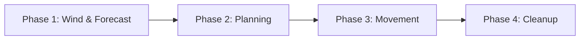

# Cardboard Regatta

## Table of Contents
- [Components & Core Concepts](#components--core-concepts)
  - [Components](#components)
  - [Points of Sail & Hex Geometry](#points-of-sail--hex-geometry)
- [Setup & Course Layout](#setup--course-layout)
  - [Race Setup](#race-setup)
  - [Starting Line Layout](#starting-line-layout-flat-topped-hexes--vertical-columns)
  - [Sailing Instructions](#sailing-instructions-sailing-the-course)
  - [Example Courses](#example-courses)
  - [Fast-Play / Quick-Start Rules](#fast-play--quick-start-rules-1015-min-sprint)
- [Turn Structure & Gameplay Phases](#turn-structure--gameplay-phases)
  - [Phase 1: Pre-Start Sequence](#phase-1-pre-start-sequence)
  - [Phase 2: Wind Phase (Optional)](#phase-2-wind-phase-optional)
  - [Phase 3: Planning Phase](#phase-3-planning-phase)
  - [Phase 4: Movement Phase](#phase-4-movement-phase)
- [Sailing Tactics & Hazards](#sailing-tactics--hazards)
  - [Wind Shadow](#wind-shadow)
  - [Rounding Marks](#rounding-marks)
  - [Fouling & Right-of-Way (ROW) Rules](#fouling--right-of-way-row-rules)
- [Protests & Penalties](#protests--penalties)
  - [Incurring a Protest Card](#incurring-a-protest-card)
  - [Clearing a Protest](#clearing-a-protest)
  - [No Disqualification (Never DSQ) & Leaving the Board](#no-disqualification-never-dsq--leaving-the-board)
- [Finishing the Race](#finishing-the-race)
- [Scoring System (RRS Appendix A)](#scoring-system-rrs-appendix-a)
- [Definitions](#definitions)

---

## Components & Core Concepts
> *"The pessimist complains about the wind; the optimist expects it to change; the realist adjusts the sails."* — William Arthur Ward

### Components
- **Hex Grid Board** with integrated 6-direction **Compass Rose** (0°, 60°, 120°, 180°, 240°, 300°)
- **Boat Tokens**: 3 double-sided tokens per boat indicating [Point of Sail](#term-points-of-sail) and Tack: Token 1 (Close-Hauled), Token 2 (Broad Reach), and Token 3 (Run). Side A shows [Port Tack](#term-port) (outlined in **Red**), and Side B shows [Starboard Tack](#term-starboard) (outlined in **Green**).
- **Course Mark Tokens** (Windward Mark, Leeward Mark, Reach Mark / Wing Mark, Committee Boat, Pin Mark)
- **Action Deck** for each player (containing sequence maneuver cards: [`Trim`](#term-trim), [`Tack`](#term-tack), [`Gybe`](#term-gybe), [`Bear Off`](#term-bear-off), [`Head Up`](#term-head-up), [`Luff`](#term-luff))
- **Global Wind Direction Marker** (placed on the board's Compass Rose)
- **Momentum Die for each player** (a dedicated d6 die placed on the player mat to track boat momentum 0–6)
- **Two 2d6 Dice** (for global wind shift rolls, wind forecasts, and split hex rolls)
- **Protest Cards** (for tracking RRS Rule violations and penalty discards)

### Points of Sail & Hex Geometry
Wind direction is set along hex grid axes. The 6 hex directions relative to the wind direction correspond to four [Points of Sail](#term-points-of-sail):

- **[Irons](#term-irons) (0°)**: Pointed directly into the wind (1 hex direction).
- **[Close-Hauled](#term-close-hauled) (60° / 300°)**: Pointed 60° off the wind (2 hex directions).
- **[Broad Reach](#term-broad-reach) (120° / 240°)**: Pointed 120° off the wind (2 hex directions).
- **[Run](#term-run) (180°)**: Pointed directly downwind (1 hex direction).
- **Hex Alignment**: Boat tokens are placed in hexes pointing directly toward one of the 6 flat hex sides (edges).

#### Port vs. Starboard Tack
- **[Starboard Tack](#term-starboard)**: Wind is blowing across the boat's starboard (right) side (facing 60°, 120°, or 180° relative to wind).
- **[Port Tack](#term-port)**: Wind is blowing across the boat's port (left) side (facing 300°, 240°, or 180° relative to wind).
- **[Tack State in Irons](#term-irons)**: For game purposes, a boat in [Irons](#term-irons) (facing 0° North into the wind) maintains the **tack she was on** ([Port](#term-port) or [Starboard](#term-starboard)) immediately prior to entering Irons for both token display and [Right-of-Way](#term-right-of-way) rules.
- **Token Swapping & Flipping**: Each boat has 3 double-sided tokens corresponding to the three sailing [Points of Sail](#term-points-of-sail) (Close-Hauled, Broad Reach, and Run). Side A shows [Port Tack](#term-port) (outlined in **Red**), and Side B shows [Starboard Tack](#term-starboard) (outlined in **Green**). Swap or flip your active boat token whenever your boat changes Point of Sail or changes tacks via a [`Tack`](#term-tack) or [`Gybe`](#term-gybe) maneuver.

> [!TIP]
> **How to Escape Irons:** When your boat is in [Irons](#term-irons) (facing 0° North), you cannot play [`Trim`](#term-trim) or [`Head Up`](#term-head-up). To get out of Irons, play a **[`Bear Off`](#term-bear-off)** action card (which turns your boat 60° to [Close-Hauled](#term-close-hauled), even at Momentum 0). Alternatively, play **[`Luff`](#term-luff)** to spill wind and remain in place until you can bear off.

---

## Setup & Course Layout
> *"To desire nothing beyond what you have is surely the best waypoint on any course."* — Joshua Slocum

### Race Setup
1. Set the **Wind direction marker** pointing straight down the board (North to South / 0° to 180°).
2. Set the **starting line length** to at least equal the number of boats (e.g., if there are 4 boats, use at least 4 hexes between the pin and committee boat).
3. Setup [windward](#term-windward) and [leeward](#term-leeward) [marks](#term-mark) as required by the race course.
4. Players randomly choose their boats (each boat has a matching maneuver deck). Roll a die to determine the starting player.
5. The starting player places their boat on a hex anywhere in the pre-start area at any [point of sail](#term-points-of-sail) and at any starting momentum (from Momentum 0 up to the Point of Sail's maximum momentum). 
6. Proceeding clockwise, each subsequent player places their boat. Each subsequent boat must be placed at least 2 hexes away from any previously placed boat.

### Starting Line Layout (Flat-Topped Hexes — Vertical Columns)
On a flat-topped hex grid arranged in vertical columns, North (0°) and South (180°) move straight up and down along vertical columns, while adjacent columns stagger diagonally. 

With wind blowing straight down the board (North to South / 0° to 180°), the starting line is defined as follows:
- **The Starting Line**: The imaginary straight line segment connecting the center of the [Pin Mark](#term-pin-mark) hex to the center of the [Committee Boat](#term-committee-boat) hex.
- **Dynamic Line Length**: The length of the starting line is determined during setup:
  $$\text{Start Line Length (hexes)} = \text{Number of Entered Boats} + \mathbf{1d6}$$
  * *Committee Boat* is placed at `(0, 0)`.
  * *Pin Mark* is placed $L$ hexes to the left at `(-L, 0)`.
  * *Course Axis (Marks)*: Buoys are placed along column $q = -L \div 2$ to align with the center of the line.
- **Line Boundaries**:
  - **Pre-Start Area**: All hexes lying entirely on the South ([downwind](#term-leeward)) side of the starting line segment.
  - **Course Side**: All hexes lying entirely on the North ([upwind](#term-windward)) side of the starting line segment.
  - **Split Line Hexes**: If a boat is in a hex that is bisected/split by the starting line segment when the start gun fires, roll **1d6**:
    - **1–3**: The boat is on the **Course Side ([OCS](#term-ocs))**.
    - **4–6**: The boat is in the **Pre-Start Area**.
  - **Crossing the Line**: A boat legally starts when its movement path moves from a pre-start hex across the imaginary line segment (between the [Pin Mark](#term-pin-mark) and [Committee Boat](#term-committee-boat)) into a course hex.

### Sailing Instructions (Sailing the Course)
To legally complete a race, boats must follow official Sailing Instructions (RRS Rule 28):

1. **Start Legally**: Pass through the starting line segment from the pre-start area (South) to the course side (North) after the start gun fires (or re-cross legally if [OCS](#term-ocs)).
2. **Mark Rounding Direction (Default: Leave to Port)**: Unless specified otherwise by the course layout, all [marks](#term-mark) must be rounded **leaving the mark to [Port](#term-port) (Left)** (counter-clockwise rounding).
3. **Course Leg Sequence (The String Rule)**: Boats must round each [mark](#term-mark) in the exact sequence specified by the course legs (e.g., Leg 1 ➔ Leg 2 ➔ Leg 3). A boat’s track, if drawn as a string from start to finish, must wrap around the required side of each mark in sequence.
4. **Finish Legally**: Cross the finish line segment between the two finish marks in the direction indicated by the final course leg.

### Example Courses

#### 🏆 Course 1: Standard Windward-Leeward (3 Legs — 30–40 Mins)
*The classic competitive regatta layout testing upwind tacking and downwind tactical positioning.*
- **[Windward Mark](#term-windward)**: Placed 10 hexes upwind (North) of the starting line.
- **[Leeward Mark](#term-leeward)**: Placed 10 hexes downwind (South) of the starting line (below the start line).
- **Leg Sequence**:
  1. **Leg 1 (Upwind)**: Start Line ➔ [Windward Mark](#term-windward) *(round leaving mark to [Port](#term-port) / Left)*.
  2. **Leg 2 (Downwind)**: Windward Mark ➔ [Leeward Mark](#term-leeward) *(round leaving mark to [Port](#term-port) / Left)*.
  3. **Leg 3 (Upwind Sprint)**: Leeward Mark ➔ Finish Line *(Start Line)*.

#### ⚡ Course 2: Beginner Sprint (2 Legs — 10–15 Mins)
*A fast, action-packed introductory race designed for rapid tabletop play and learning points of sail.*
- **[Windward Mark](#term-windward)**: Placed 4 hexes upwind (North) of the starting line (`pos: [2, -4]`).
- **Leg Sequence**:
  1. **Leg 1 (Upwind)**: Start Line ➔ [Windward Mark](#term-windward) *(round leaving mark to [Port](#term-port) / Left)*.
  2. **Leg 2 (Downwind Finish)**: Windward Mark ➔ Downwind Finish Line *(Start Line)*.

#### 📐 Course 3: Triangle (5 Legs — 35–45 Mins)
*An advanced course testing broad reach speed, gybing maneuvers, and mark rounding strategy.*
- **[Windward Mark](#term-windward)**: Placed 8 hexes North (0° upwind) of the starting line.
- **Reach Mark (Wing)**: Placed 6 hexes South-West (240°) from the Windward Mark (left of windward).
- **[Leeward Mark](#term-leeward)**: Placed 6 hexes South-East (120°) from the Reach Mark (directly downwind of the Windward Mark).
- **Leg Sequence**:
  1. **Leg 1 (Upwind)**: Start Line ➔ [Windward Mark](#term-windward) *(leave to [Port](#term-port) / Left)*.
  2. **Leg 2 (Reaching)**: Windward Mark ➔ Reach Mark *(leave to [Port](#term-port) / Left)*.
  3. **Leg 3 (Reaching)**: Reach Mark ➔ [Leeward Mark](#term-leeward) *(leave to [Port](#term-port) / Left)*.
  4. **Leg 4 (Upwind)**: Leeward Mark ➔ [Windward Mark](#term-windward) *(leave to [Port](#term-port) / Left)*.
  5. **Leg 5 (Downwind Finish)**: Windward Mark ➔ Downwind Finish Line *(Start Line)*.

### Fast-Play / Quick-Start Rules (10–15 Min Sprint)
For introductory games or fast tabletop sessions that finish in **10 to 15 minutes max**, use these streamlined rules:

1. **Use Course 2 (Beginner Sprint)**: Play **Course 2: Beginner Sprint** (Leg 1 Upwind to the Windward Mark 4 hexes North ➔ Leg 2 Downwind Finish at the Start Line).
2. **Instant Start**: Skip the 3-turn pre-start countdown sequence. Place all boats in the Pre-Start Area at **Momentum 2 or 3** facing their chosen [point of sail](#term-points-of-sail). The start gun fires immediately on **Round 1**!

---

## Turn Structure & Gameplay Phases
> *"He that will not sail till all dangers are over must never put to sea."* — Thomas Fuller

### Pre-Start Sequence (Turns -3, -2, -1)
- After all players have placed their boats, the pre-start sequence begins and lasts for **3 turns** (Turns -3, -2, -1).
- Players maneuver for starting position during these 3 turns using standard Planning and Movement phases.
- Use a **d6** to count down the 3 pre-start turns (3, 2, 1).
- **On Course Side ([OCS](#term-ocs)) Rule**: At the end of Turn -1 (when the start gun fires), any boat on the course side of the starting line is **[OCS](#term-ocs)**.
  - **Split Hex Determination**: If a boat ends Turn -1 on a hex that is split by the starting line segment, roll **1d6**: on **1–3**, the boat is **[OCS](#term-ocs)**; on **4–6**, the boat counts as **Pre-Start**.
  - An OCS boat must maneuver its token so that it is **entirely on the pre-start side of the starting line** before it can legally cross the start line to begin Leg 1.
  - **OCS [Right-of-Way](#term-right-of-way)**: A boat returning to the pre-start side after starting early ([OCS](#term-ocs)) has **no [Right-of-Way](#term-right-of-way)** and must [keep clear](#term-keep-clear) of all boats that started legally.

---

### Per-Round Gameplay Loop (4 Phases)

#### Phase 1: Wind & Forecast Phase
At the start of each round—**before** players plan their action cards in Phase 2:
1. **Apply Current Wind Shift**: Apply the active global wind shift or puff for the round and adjust the **Global Wind Direction Marker** on the board's **Compass Rose**.
2. **Roll Wind Forecast**: Roll **2d6** on the Global Wind Shift Table to generate the **Wind Forecast** for the *next* round, placing the Forecast Marker on the Compass Rose. All players will see this forecast when planning their cards in Phase 2!

##### Global Wind States & Limits
Global wind can only ever be in one of **three states**:
* **Base Wind (0° / Center)**: Wind blows straight down the board (North to South).
* **Left Shift (300° / -60°)**: Wind blows from 300° (1 hex side counter-clockwise).
* **Right Shift (60° / +60°)**: Wind blows from 60° (1 hex side clockwise).

> [!IMPORTANT]
> **Hard Limit:** The wind can **never** shift more than 60° (1 hex side) away from the Base Wind (0°). If a shift is rolled that would exceed this limit, the wind direction does not change and remains capped at that limit.

##### 2d6 Global Wind Shift Table
Roll **2d6** on the wind shift table:

| 2d6 Roll | Wind Event | Description |
|---|---|---|
| **2** | **Puff + Shift Left** | All boats get **+1 Momentum** this round. Global wind shifts 60° counter-clockwise (max 300°). |
| **3–4** | **Shift Left** | Global wind shifts 60° counter-clockwise (max 300°). |
| **5–9** | **Steady** | Wind direction remains at its current heading. |
| **10–11** | **Shift Right** | Global wind shifts 60° clockwise (max 60°). |
| **12** | **Puff + Shift Right** | All boats get **+1 Momentum** this round. Global wind shifts 60° clockwise (max 60°). |

#### Phase 2: Planning Phase
- Every round, players receive **4 Action slots** during the planning phase.
- Select 4 action cards from your maneuver deck and place them face-down in order (Action 1, Action 2, Action 3, Action 4).
- Cards feature [Point of Sail](#term-points-of-sail) icons: **Green** for valid points of sail, **Red** for invalid points of sail.

##### Actions Summary
| Action | Qty | Valid Points of Sail (POS) | Requirements | Maneuver Effects |
|---|---|---|---|---|
| **[Head Up](#term-head-up)** | x2 | Any except [Irons](#term-irons) | Momentum 1+ | Move **1 hex forward**, rotate facing 60° towards the wind (upwind / 0° North). |
| **[Bear Off](#term-bear-off)** | x2 | Any except [Run](#term-run) | None (Allowed at Momentum 0) | Move **1 hex forward**, rotate facing 60° away from the wind. *(If played at Momentum 0 to exit Irons, pivots in place with 0 hex forward movement).* |
| **[Tack](#term-tack)** | x1 | [Close-Hauled](#term-close-hauled) | Momentum 1+ | Move **1 hex forward**, rotate facing 120° across the wind to opposite tack, reduce Momentum by 1 (min Momentum 0). |
| **[Gybe](#term-gybe)** | x1 | [Run](#term-run) | Momentum 1+ | Move **1 hex forward**, flip tack ([Port](#term-port)/[Starboard](#term-starboard)) downwind. |
| **[Luff](#term-luff)** | x2 | [Close-Hauled](#term-close-hauled), [Broad-Reach](#term-broad-reach), or [Irons](#term-irons) | None (Allowed at Momentum 0) | Move **1 hex forward** and reduce Momentum by 1. *(If played at Momentum 0, boat does not move).* |
| **[Trim](#term-trim)** | x4 | Any except [Irons](#term-irons) | None | Move **1 hex forward**, increase Momentum by 1 (up to POS max momentum cap). |

#### Phase 3: Movement Phase

##### Initiative
At the start of the Movement Phase, initiative determines turn order:
1. The player whose boat is furthest **[upwind](#term-windward)** (closest to the wind source) has **Initiative** and acts first.
2. If tied for upwind distance, the boat with **higher Momentum** acts first.
3. If still tied, the tied players roll a **1d6**, with the highest roll acting first.

##### Point of Sail Momentum Limits
Each **[Trim](#term-trim)** action increases Momentum by 1 up to the maximum momentum for your current [Point of Sail](#term-points-of-sail):

| Point of Sail | Base Max Momentum | With Global Puff (+1) | Effect |
|---|:---:|:---:|---|
| **[Close-Hauled](#term-close-hauled)** | 4 | 5 | Upwind point of sail. |
| **[Broad-Reach](#term-broad-reach)** | 5 | **6** *(Max d6!)* | Reaching point of sail (Fastest!). |
| **[Run](#term-run)** | 4 | 5 | Downwind point of sail. |
| **[Irons](#term-irons)** | — | — | Momentum automatically reduced by 1 at start of turn. Cannot play [`Trim`](#term-trim). |

##### Action Resolution (Round-Robin)
Movement is executed in 4 **Action Steps** (Action 1 through Action 4):
1. For each Action Step, all players reveal their planned card for that step in Initiative order.
2. **The Golden Movement Rule**: Whenever your boat has **Momentum 1+**, playing ANY maneuver card moves your boat **1 hex forward** in your current facing direction first before applying rotation or momentum changes. *(At Momentum 0, `Bear Off` pivots 60° away from the wind in place with 0 hex forward movement).*
3. **Board Boundaries**: If a boat's forward movement would cause it to move off the physical edge of the game board (outside the course's coordinate bounds), it hits the invisible wall. The boat's movement is canceled for that action step, and its Momentum immediately drops to 0.
3. **Illegal Actions**: If an action is illegal for the current POS or momentum state, it is discarded without effect. If the boat has forward momentum (Momentum 1+), it coasts forward 1 hex without rotating; if Momentum is 0, the boat remains in place.
4. **Instant Collision & ROW Resolution**: Collision checks and Right-of-Way evaluations occur **instantly during each Action Step**. If a boat enters a hex occupied by another boat (or both enter the same hex during an Action Step), a collision occurs immediately on that step and ROW rules determine who receives a Protest card.

#### Phase 4: Cleanup Phase
All players retrieve their played action cards back into their hand for the next round (except any cards set aside to clear a Protest).

---

## Sailing Tactics & Hazards
> *"To win a regatta, you must first finish the race."* — Sir Peter Blake

### Wind Shadow
- **[Wind Shadow](#term-wind-shadow) Area**: The 2 hexes directly [downwind](#term-leeward) of any boat (in the direction the wind is blowing, independent of the boat's facing angle).
- **Planning Phase Effect**: If your boat *starts* the Planning Phase in another boat's [Wind Shadow](#term-wind-shadow), its maximum momentum for the round is reduced by 1 (minimum max momentum 1). You still plan all 4 action cards.
- **Movement Phase Effect**: If your boat *enters* a [Wind Shadow](#term-wind-shadow) during movement, its current Momentum is immediately reduced by 1.

### Rounding Marks
- **Ending in a Mark Hex**: If you end an Action Step or turn in a hex containing a [mark](#term-mark), you hit the mark and incur a **Protest card**.
- **Passing Through a Mark**: If a boat moves *through* a hex containing a [mark](#term-mark) during an Action Step without ending its turn there, roll **1d6**. On a roll of **1**, the boat hits the mark and incurs a **Protest card**.
- **Mark Penalty Limit**: A boat can receive a maximum of 1 Protest card per round from any individual mark.

### Fouling & Right-of-Way (ROW) Rules

> [!IMPORTANT]
> **The Golden Hex Collision Rule:** A Right-of-Way foul **ONLY occurs when two boats attempt to occupy or enter the exact same hex at the same time**. Whenever two boats collide in the same hex, Right-of-Way priorities (Rules 10–14) determine which boat was at fault and incurs the **Protest card**.

| RRS Rule | Sailing Rule Name | Tabletop Hex Grid Definition | Right-of-Way (ROW) Priority |
|---|---|---|---|
| **Rule 10** | **Starboard vs. Port** | Boats are on **different tacks** (one Port, one Starboard). | **Starboard Tack** has ROW over Port Tack. |
| **Rule 11** | **Same Tack — Overlapped** | Boats are on the same tack, sailing **side-by-side in adjacent hex columns**. | **Leeward boat** (further downwind / South) has ROW over Windward boat. |
| **Rule 12** | **Same Tack — Not Overlapped** | Boats are on the same tack, sailing **one behind the other in the same hex line**. | **Boat Ahead** has ROW over the Boat Astern (behind). |
| **Rule 13** | **Tacking** | A boat is executing a **[`Tack`](#term-tack) card**. | **Non-tacking boats** have ROW over a tacking boat. |

#### Detailed Right-of-Way Priorities

1. **Rule 10 (Starboard vs. Port)**: A boat on **[Starboard Tack](#term-starboard)** has [Right-of-Way](#term-right-of-way) over a boat on **[Port Tack](#term-port)**. The Port tack boat must [keep clear](#term-keep-clear).
2. **Rule 11 (Same Tack — Overlapped / Side-by-Side)**: When on the same tack in adjacent hex columns (side-by-side / overlapped), the **[Leeward](#term-leeward) boat** (further downwind / South) has [Right-of-Way](#term-right-of-way) over the **[Windward](#term-windward) boat** (further upwind / North). The Windward boat must [keep clear](#term-keep-clear).
3. **Rule 12 (Same Tack — Not Overlapped / Clear Astern)**: When on the same tack in the same hex line (one behind the other), the boat ahead ([clear ahead](#term-clear-ahead)) has [Right-of-Way](#term-right-of-way). The boat coming from behind ([clear astern](#term-clear-ahead)) must [keep clear](#term-keep-clear).
4. **Rule 13 (Tacking)**: While executing a **[`Tack`](#term-tack)** card, a boat has no [Right-of-Way](#term-right-of-way) and must [keep clear](#term-keep-clear) of all non-tacking boats.
5. **Returning OCS Boat**: A boat returning to the pre-start side after starting early ([OCS](#term-ocs)) has no [Right-of-Way](#term-right-of-way) and must [keep clear](#term-keep-clear) of all boats that started legally.

> [!IMPORTANT]
> **Avoiding Contact (RRS Rule 14):** Having Right-of-Way does **not** give a boat permission to deliberately ram another boat. If a ROW boat could easily avoid contact but intentionally sails into a hex occupied by another boat to force a collision penalty, the ramming boat incurs the **Protest card** for failing to avoid contact.

#### Example Hex Movements & Foul Scenarios

* **Example 1 (Rule 10: Starboard vs. Port Crossing)**: Boat A (Starboard Tack) and Boat B (Port Tack) are converging diagonally toward the same empty hex on an upwind leg. Both boats play [`Trim`](#term-trim) and attempt to enter that hex on the same action step. Because Starboard Tack has Right-of-Way, **Boat B (Port Tack) fouls Boat A and incurs a Protest card**.
* **Example 2 (Rule 11: Windward vs. Leeward Collisions)**: Boat A (Windward) and Boat B (Leeward) are sailing close-hauled side-by-side in adjacent hex columns. Boat A has initiative and plays [`Bear Off`](#term-bear-off) + [`Trim`](#term-trim), steering down into the hex currently occupied by Boat B. Because the Leeward boat has Right-of-Way, **Boat A (Windward) fouls Boat B and incurs a Protest card**.
* **Example 3 (Rule 12: Overrunning a Boat Ahead Downwind)**: On a downwind leg (sailing South), Boat A is cruising ahead at Momentum 2. Boat B is trailing directly behind in the same hex line at Momentum 4. Boat B plays [`Trim`](#term-trim) + [`Trim`](#term-trim), overrunning and ramming Boat A from behind. Because a boat coming from behind must keep clear of the boat ahead, **Boat B (Astern) fouls Boat A and incurs a Protest card**.
* **Example 4 (Rule 13: Tacking into a Collision)**: Boat A (on Starboard Tack) plays a [`Tack`](#term-tack) card, moving forward 1 hex directly into the hex occupied by Boat B and tacking onto Port Tack. Because a tacking boat has no Right-of-Way under RRS Rule 13 while executing a tack, **Boat A (Tacking) fouls Boat B and incurs a Protest card**. *(Note: Tacking into an empty hex 1 space ahead of another boat without colliding is 100% legal!).*

---

## Protests & Penalties
> *"Good judgment comes from experience, and experience comes from bad judgment."* — Mark Twain

### Incurring a Protest Card
A boat takes a **Protest card** if it:
- Ends an Action Step or turn in a hex containing a [mark](#term-mark) on the current leg.
- Moves through a mark's hex and rolls a **1** on **1d6**.
- Violates [Right-of-Way](#term-right-of-way) and collides with another boat into the same hex.

> [!NOTE]
> **Protest Limit (Max 1 per Round):** A boat can incur a maximum of **1 Protest Card per round**, regardless of how many collisions or mark contacts occur during that round.

### Clearing a Protest
- A player **must clear their Protest card as soon as able** (on the very next Planning Phase).
- **Random Discard Procedure**: During the Planning Phase, the player shuffles their maneuver deck face-down and draws **2 random action cards** to set aside for the round (leaving only 2 active action slots to plan for that round).
- Once the round is complete and the 2-card discard penalty is resolved, return the 2 discarded cards to the player's maneuver deck and remove the Protest card.

### No Disqualification (Never DSQ) & Leaving the Board
- **No Player Elimination (Never DSQ)**: In *Cardboard Regatta*, boats are **never disqualified** for incurring fouls or holding Protest cards! If a boat incurs another foul while holding a Protest card, she simply continues holding a Protest card and performs the 2-card random discard penalty again on her next turn. Every player stays in the race to the finish line!
- **Leaving the Board**: If a boat moves off the physical hex grid boundary, she must spend her next action step using `Bear Off` or `Head Up` to return onto the board.

---

## Finishing the Race
> *"It is not the ship so much as the skillful sailing that assures the prosperous voyage."* — George William Curtis

- **Finish Line Layout**: The finish line is the imaginary straight line segment connecting the centers of the two finish line [marks](#term-mark) (such as the [Pin Mark](#term-pin-mark) and [Committee Boat](#term-committee-boat)).
- **Crossing the Finish Line**: A boat finishes the race when its movement path crosses the imaginary finish line segment between the two marks from the course side to the finish side.
- **Split Finish Line Hexes**: If a boat ends an Action Step in a hex that is bisected/split by the finish line segment, roll **1d6**:
  - **1–3**: The boat is determined to still be on the **Course Side** (has not legally finished yet).
  - **4–6**: The boat is determined to be on the **Finish Side** (legally finished!).

---

## Scoring System (RRS Appendix A)
> *"You don't win a regatta in the first race, but you can certainly lose it."* — Dennis Conner

Cardboard Regatta uses the official **Low-Point System** from Appendix A of the *Racing Rules of Sailing*.

### Race Points
In each individual race, boats receive points matching their finishing order:

| Finishing Status | Points Awarded |
|---|---|
| **1st Place** | 1 point |
| **2nd Place** | 2 points |
| **3rd Place** | 3 points |
| **4th Place** | 4 points |
| **Nth Place** | N points |
| **DNF / DSQ / [OCS](#term-ocs)** | Total number of entered boats + 1 point |

* **DNF** (Did Not Finish): Failed to complete all course legs.
* **DSQ** (Disqualified): Crosses the finish line holding a Protest card, incurs a 2nd penalty, or leaves the board.
* **[OCS](#term-ocs)** (On Course Side): Fails to re-cross the start line legally after starting early.

### Dead Heat Finishing Ties (RRS A7)
In Cardboard Regatta, boats execute action steps sequentially based on initiative during Phase 4. If a boat crosses the finish line on Action Step 2, it finishes ahead of a boat crossing on Action Step 3. 

However, if two or more boats cross the finish line on the **exact same Action Step** of the same round:
* **Splitting Points (RRS A7)**: The points for the tied finishing position and the position(s) immediately below it are summed together and divided equally among the tied boats:
  * **2-Way Tie for 1st Place**: $(1 + 2) \div 2 = \mathbf{1.5\text{ points each}}$.
  * **2-Way Tie for 2nd Place**: $(2 + 3) \div 2 = \mathbf{2.5\text{ points each}}$.
  * **3-Way Tie for 2nd Place**: $(2 + 3 + 4) \div 3 = \mathbf{3.0\text{ points each}}$.
* **Next Finisher**: The next boat to finish receives the points for the position following the tied places (e.g. after a 2-way tie for 1st place, the next boat receives 3rd place / 3 points).

### Series Regatta Scoring
- **Series Score**: A boat’s regatta score is the total sum of points across all races in the series.
- **Throwouts (Discards)**: If **4 or more races** are played in a regatta series, each boat discards (excludes) its single worst race score from its total.
- **Winner**: The boat with the **lowest cumulative series score** wins the regatta!

### Series Tie-Breaking (RRS A8)
If two or more boats are tied in total series points:
1. **Most High Finishes**: The tie is awarded to the boat with the most 1st-place finishes. If still tied, the boat with the most 2nd-place finishes, and so on.
2. **Last Race Standings**: If still tied, the tie is broken by whichever tied boat finished higher in the final race of the series.

---

## Definitions
> *"Beyond the edge of the chart there be dragons, but also the joy of discovery."*

For players new to sailing, here is a quick reference guide to common sailing and racing terms used in Cardboard Regatta:

| Term | Definition |
|---|---|
| **Port** | The **left** side of a boat when facing forward towards the bow. |
| **Starboard** | The **right** side of a boat when facing forward towards the bow. |
| **Bow** | The front end of the boat. |
| **Stern** | The back end of the boat. |
| **Windward** | Upwind; closer to the direction the wind is blowing from (towards North / 0°). |
| **Leeward** | Downwind; further in the direction the wind is blowing toward (towards South / 180°). |
| **Points of Sail** | The angle of a boat relative to the wind direction ([Irons](#term-irons), [Close-Hauled](#term-close-hauled), [Broad Reach](#term-broad-reach), [Run](#term-run)). |
| **Irons (Head to Wind)** | Pointed directly into the wind (0°). Momentum drops by 1 each turn and you cannot play `Sail`. Play a [`Bear Off`](#term-bear-off) card to turn out of Irons. |
| **Close-Hauled** | Sailing as close to the wind direction as possible (60° / 300°). |
| **Broad Reach** | Sailing diagonally away from the wind direction (120° / 240°). Maximum boat momentum (4). |
| **Run** | Sailing directly downwind with the wind coming over the stern (180°). |
| **Tack** | Turning the bow (front) of the boat through the wind to change from one side to the other. |
| **Gybe (Jibe)** | Turning the stern (back) of the boat through the wind while sailing downwind. |
| **Head Up** | Steering the boat closer toward the wind direction (60° turn). |
| **Bear Off (Bear Away)** | Steering the boat further away from the wind direction (60° turn). |
| **Luff** | Easing sails to spill wind and slow down without changing facing direction. |
| **Trim** | Adjusting sails to catch wind. The primary action card to increase momentum and sail 1 hex forward. |
| **Right-of-Way (ROW)** | The legal entitlement under RRS Part 2 of a boat to hold its position/course. Other boats must *[Keep Clear](#term-keep-clear)*. |
| **Keep Clear** | Steering/positioning your boat so a [Right-of-Way](#term-right-of-way) boat can sail her course without taking avoiding action. |
| **Clear Ahead / Clear Astern** | A boat is *Clear Astern* when its hull is entirely behind an imaginary line perpendicular to a boat ahead (*Clear Ahead*). |
| **Mark** | An anchored buoy in the water that boats must round during the race. |
| **Pin Mark** | The orange buoy marking the left ([Port](#term-port)) end of the starting line. |
| **Committee Boat** | The official race boat anchored at the right ([Starboard](#term-starboard)) end of the starting line. |
| **OCS (On Course Side)** | Crossing the starting line onto the course side before the start gun fires (starting early). |
| **Wind Shadow** | The 2-hex blanketed area downwind of a boat where wind velocity and max momentum are reduced. |
