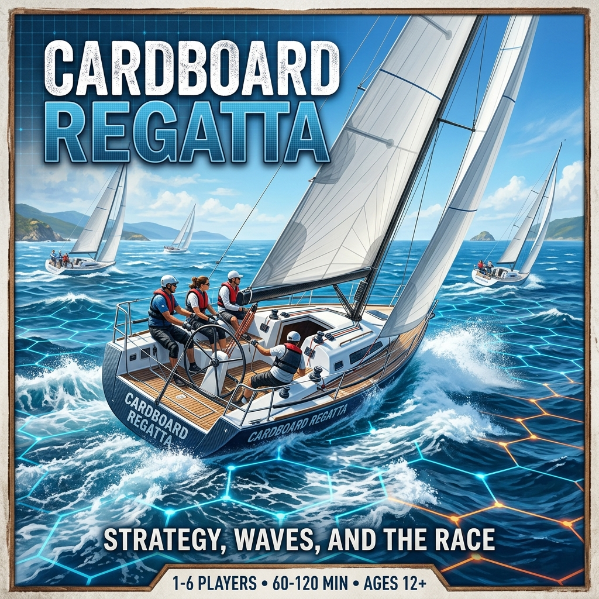
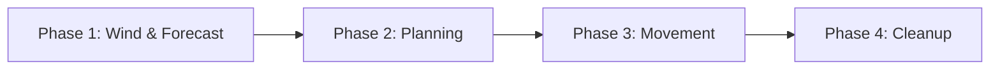

# ⛵ Cardboard Regatta: Official Rulebook



## Table of Contents
- [Components & Core Concepts](#components--core-concepts)
  - [Components](#components)
  - [Points of Sail & Hex Geometry](#points-of-sail--hex-geometry)
- [Setup & Course Layout](#setup--course-layout)
  - [Race Setup](#race-setup)
  - [Starting Line Layout](#starting-line-layout-laying-a-square-line)
  - [Sailing Instructions](#sailing-instructions-sailing-the-course)
  - [Example Courses](#example-courses)
  - [Fast-Play / Quick-Start Rules](#fast-play--quick-start-rules-sprint)
- [Turn Structure & Gameplay Phases](#turn-structure--gameplay-phases)
  - [Pre-Start Sequence](#pre-start-sequence-turns--3--2--1)
  - [Phase 1: Wind & Forecast Phase](#phase-1-wind--forecast-phase)
  - [Phase 2: Planning Phase](#phase-2-planning-phase)
  - [Phase 3: Movement Phase](#phase-3-movement-phase)
  - [Phase 4: Cleanup Phase](#phase-4-cleanup-phase)
- [Sailing Tactics & Hazards](#sailing-tactics--hazards)
  - [Wind Shadow](#wind-shadow)
  - [Rounding Marks](#rounding-marks)
  - [Fouling & Right-of-Way (ROW) Rules](#fouling--right-of-way-row-rules)
    - [The Bail Out](#-the-bail-out-declining-a-collision)
- [Protests & Penalties](#protests--penalties)
  - [Incurring a Protest Card](#incurring-a-protest-card)
  - [Clearing a Protest](#clearing-a-protest)
  - [No Disqualification (Never DSQ)](#no-disqualification-never-dsq)
- [Finishing the Race](#finishing-the-race)
  - [The Finishing Window](#the-finishing-window)
- [Scoring System (RRS Appendix A)](#scoring-system-rrs-appendix-a)
- [Definitions](#definitions)

---

## Components & Core Concepts
> *"The pessimist complains about the wind; the optimist expects it to change; the realist adjusts the sails."* — William Arthur Ward

### Components
- **Hex Grid Board** with integrated 6-direction **Compass Rose** (0°, 60°, 120°, 180°, 240°, 300°)
- **Boat Tokens**: 3 double-sided tokens per boat indicating [Point of Sail](#term-points-of-sail) and Tack: Token 1 (Close-Hauled), Token 2 (Broad Reach), and Token 3 (Run). Side A shows [Port Tack](#term-port) (outlined in **Red**), and Side B shows [Starboard Tack](#term-starboard) (outlined in **Green**). *There is no Irons token — a boat in [Irons](#term-irons) keeps the token she was already showing, since she holds the tack she was on.*
- **Course Mark Tokens** (Windward Mark, Leeward Mark, Reach Mark / Wing Mark, Committee Boat, Pin Mark)
- **Action Deck** for each player (containing sequence maneuver cards: [`Trim`](#term-trim), [`Tack`](#term-tack), [`Gybe`](#term-gybe), [`Bear Off`](#term-bear-off), [`Head Up`](#term-head-up), [`Luff`](#term-luff))
- **Global Wind Direction Marker** (placed on the board's Compass Rose — the wind blowing *now*)
- **Wind Forecast Marker** (a second, distinct marker on the Compass Rose — the wind arriving *next* round)
- **Momentum Tracker for each player** (a 0–6 dial or track on the player mat. Note a plain d6 cannot show 0, and 6 is reachable on a [Broad Reach](#term-broad-reach) in a [Puff](#term-puff), so use a track rather than a die)
- **2d6** (a pair of six-sided dice, for global wind shift and wind forecast rolls)
- **Protest Cards** (for tracking RRS Rule violations and penalty discards)

### Points of Sail & Hex Geometry
Wind direction is set along hex grid axes. The 6 hex directions relative to the wind direction correspond to four [Points of Sail](#term-points-of-sail):

- **[Irons](#term-irons) (0°)**: Pointed directly into the wind (1 hex direction).
- **[Close-Hauled](#term-close-hauled) (60° / 300°)**: Pointed 60° off the wind (2 hex directions).
- **[Broad Reach](#term-broad-reach) (120° / 240°)**: Pointed 120° off the wind (2 hex directions).
- **[Run](#term-run) (180°)**: Pointed directly downwind (1 hex direction).
- **Hex Alignment**: Boat tokens are placed in hexes pointing directly toward one of the 6 flat hex sides (edges).

#### Port vs. Starboard Tack
- **[Starboard Tack](#term-starboard)**: Wind is blowing across the boat's starboard (right) side (facing 60°, 120°, or 180° relative to wind).
- **[Port Tack](#term-port)**: Wind is blowing across the boat's port (left) side (facing 300°, 240°, or 180° relative to wind).
- **[Tack State in Irons](#term-irons)**: For game purposes, a boat in [Irons](#term-irons) (facing 0° North into the wind) maintains the **tack she was on** ([Port](#term-port) or [Starboard](#term-starboard)) immediately prior to entering Irons for both token display and [Right-of-Way](#term-right-of-way) rules.
- **Token Swapping & Flipping**: Each boat has 3 double-sided tokens corresponding to the three sailing [Points of Sail](#term-points-of-sail) (Close-Hauled, Broad Reach, and Run). Side A shows [Port Tack](#term-port) (outlined in **Red**), and Side B shows [Starboard Tack](#term-starboard) (outlined in **Green**). Swap or flip your active boat token whenever your boat changes Point of Sail or changes tacks via a [`Tack`](#term-tack) or [`Gybe`](#term-gybe) maneuver.

> [!TIP]
> **How to Escape Irons:** When your boat is in [Irons](#term-irons) (facing 0° North), you cannot play [`Trim`](#term-trim) or [`Head Up`](#term-head-up). To get out of Irons, play a **[`Bear Off`](#term-bear-off)** action card (which turns your boat 60° to [Close-Hauled](#term-close-hauled), even at Momentum 0). Alternatively, play **[`Luff`](#term-luff)** to spill wind and remain in place until you can bear off.

---

## Setup & Course Layout
> *"To desire nothing beyond what you have is surely the best waypoint on any course."* — Joshua Slocum

### Race Setup
1. Set the **Wind direction marker** pointing straight down the board (North to South / 0° to 180°).
2. Set the **starting line length** to the number of boats **+ 2** (e.g. 4 boats ➔ a 6-hex line between the pin and the committee boat), and lay it **square to the wind** — see [Starting Line Layout](#starting-line-layout-laying-a-square-line).
3. Setup [windward](#term-windward) and [leeward](#term-leeward) [marks](#term-mark) as required by the race course.
4. Players randomly choose their boats (each boat has a matching maneuver deck). Roll a die to determine the starting player.
5. The starting player places their boat on any **unoccupied** hex in the pre-start area, at any [point of sail](#term-points-of-sail) and any starting momentum (from Momentum 0 up to that point of sail's maximum). Momentum **2** is a sensible default — enough to manoeuvre without being carried over the line.
6. Proceeding clockwise, each subsequent player places their boat on an unoccupied hex. Boats may be placed side by side: the line is only $L$ = boats + 2 hexes long, so there is not room to spread the fleet out, and jostling for the favoured end is part of the pre-start.

### Starting Line Layout (Laying a Square Line)
On a flat-topped hex grid arranged in vertical columns, North (0°) and South (180°) run straight up and down a column, while adjacent columns stagger half a hex. A row running *across* the board therefore **zigzags** — and that zigzag is what a square line looks like.

> [!IMPORTANT]
> **Lay the line square to the wind.** A line laid straight along one hex axis is **not** perpendicular to the wind — it runs at 30° to it, which would put the pin end half a hex further upwind for every hex of line length. On a 6-hex line that is a **3-hex head start** at the pin. Build the line by alternating, so the two ends sit exactly the same distance upwind.

- **The Starting Line**: The imaginary straight line segment connecting the center of the [Pin Mark](#term-pin-mark) hex to the center of the [Committee Boat](#term-committee-boat) hex.
- **Line Length**: $$\text{Start Line Length (hexes)} = \text{Number of Entered Boats} + 2$$
- **Laying the line**: Place the **Committee Boat** at the starboard (right) end. Then step towards the pin by **alternating 300° (up-left) and 240° (down-left)**, one hex at a time, until you have stepped $L$ times. Place the **Pin Mark** there. Every second hex along the way sits exactly on the line; the ones between sit half a hex to one side. Both ends finish level.

| Step | Direction | Hex | Distance upwind |
|:---:|---|:---:|:---:|
| 0 | — (Committee Boat) | `(0, 0)` | 0 |
| 1 | 300° up-left | `(-1, 0)` | +½ |
| 2 | 240° down-left | `(-2, 1)` | 0 |
| 3 | 300° up-left | `(-3, 1)` | +½ |
| 4 | 240° down-left | `(-4, 2)` | 0 |
| 5 | 300° up-left | `(-5, 2)` | +½ |
| 6 | 240° down-left | `(-6, 3)` | **0 — Pin Mark** |

- **Course Axis (Marks)**: All course [marks](#term-mark) are set from the **centre of the line**, measured in hexes **directly upwind (0°)** — so a mark "10 hexes upwind" sits 10 hexes due North of the line's midpoint.
- **Line Boundaries**:
  - **Pre-Start Area**: All hexes lying entirely on the South ([downwind](#term-leeward)) side of the starting line segment.
  - **Course Side**: All hexes lying entirely on the North ([upwind](#term-windward)) side of the starting line segment.
  - **Split Line Hexes**: If a boat is in a hex that is bisected/split by the starting line segment when the start gun fires, the boat is considered to be in the **Pre-Start Area**.
  - **Crossing the Line**: A boat legally starts when its movement path moves from a pre-start hex across the imaginary line segment (between the [Pin Mark](#term-pin-mark) and [Committee Boat](#term-committee-boat)) into a course hex.

### Sailing Instructions (Sailing the Course)
To legally complete a race, boats must follow official Sailing Instructions (RRS Rule 28):

1. **Start Legally**: Pass through the starting line segment from the pre-start area (South) to the course side (North) after the start gun fires (or re-cross legally if [OCS](#term-ocs)).
2. **Mark Rounding Direction (Default: Leave to Port)**: Unless specified otherwise by the course layout, all [marks](#term-mark) must be rounded **leaving the mark to [Port](#term-port) (Left)** (counter-clockwise rounding).
3. **Course Leg Sequence (The String Rule)**: Boats must round each [mark](#term-mark) in the exact sequence specified by the course legs (e.g., Leg 1 ➔ Leg 2 ➔ Leg 3). A boat’s track, if drawn as a string from start to finish, must wrap around the required side of each mark in sequence.
4. **Finish Legally**: Cross the finish line segment between the two finish marks in the direction indicated by the final course leg.

### Example Courses

> [!NOTE]
> Every mark below is measured **in hexes directly upwind (0°) from the centre of the starting line**. A negative figure means downwind. Courses are numbered easiest first, and match the files in `courses/`.
>
> Times are for **4 boats** with the 15-round [Finishing Window](#the-finishing-window), at roughly a minute a round. More boats means more action steps per round, so allow longer.

#### ⚡ Course 1: Beginner Sprint (2 Legs — 15–20 Mins)
*A fast, action-packed introductory race designed for rapid tabletop play and learning points of sail.*
- **[Windward Mark](#term-windward)**: **4 hexes upwind** of the centre of the starting line.
- **Leg Sequence**:
  1. **Leg 1 (Upwind)**: Start Line ➔ [Windward Mark](#term-windward) *(round leaving mark to [Port](#term-port) / Left)*.
  2. **Leg 2 (Downwind Finish)**: Windward Mark ➔ Downwind Finish Line *(Start Line)*.

#### 🏆 Course 2: Standard Windward-Leeward (3 Legs — 35–45 Mins)
*The classic competitive regatta layout testing upwind tacking and downwind tactical positioning.*
- **[Windward Mark](#term-windward)**: **10 hexes upwind** of the centre of the starting line.
- **[Leeward Mark](#term-leeward)**: **10 hexes downwind** of the centre of the starting line.
- **Leg Sequence**:
  1. **Leg 1 (Upwind)**: Start Line ➔ [Windward Mark](#term-windward) *(round leaving mark to [Port](#term-port) / Left)*.
  2. **Leg 2 (Downwind)**: Windward Mark ➔ [Leeward Mark](#term-leeward) *(round leaving mark to [Port](#term-port) / Left)*.
  3. **Leg 3 (Upwind Sprint)**: Leeward Mark ➔ Finish Line *(Start Line)*.

#### 📐 Course 3: Triangle (5 Legs — 35–45 Mins)
*An advanced course testing broad reach speed, gybing maneuvers, and mark rounding strategy.*
- **[Windward Mark](#term-windward)**: **8 hexes upwind** of the centre of the starting line.
- **Reach Mark (Wing)**: **6 hexes at 240° (South-West)** from the Windward Mark — which lands it **5 hexes upwind** of the line and **6 hexes to port** of the course axis.
- **[Leeward Mark](#term-leeward)**: **6 hexes at 120° (South-East)** from the Reach Mark — putting it back on the course axis, **2 hexes upwind** of the line and directly downwind of the Windward Mark.
- **Leg Sequence**:
  1. **Leg 1 (Upwind)**: Start Line ➔ [Windward Mark](#term-windward) *(leave to [Port](#term-port) / Left)*.
  2. **Leg 2 (Reaching)**: Windward Mark ➔ Reach Mark *(leave to [Port](#term-port) / Left)*.
  3. **Leg 3 (Reaching)**: Reach Mark ➔ [Leeward Mark](#term-leeward) *(leave to [Port](#term-port) / Left)*.
  4. **Leg 4 (Upwind)**: Leeward Mark ➔ [Windward Mark](#term-windward) *(leave to [Port](#term-port) / Left)*.
  5. **Leg 5 (Downwind Finish)**: Windward Mark ➔ Downwind Finish Line *(Start Line)*.

### Fast-Play / Quick-Start Rules (Sprint)
For introductory games or a fast tabletop session, use these streamlined rules:

1. **Use Course 1 (Beginner Sprint)**: Play **Course 1: Beginner Sprint** (Leg 1 upwind to the Windward Mark 4 hexes North ➔ Leg 2 downwind finish at the Start Line).
2. **Instant Start**: Skip the 3-turn pre-start countdown sequence. Place all boats in the Pre-Start Area at **Momentum 2 or 3** facing their chosen [point of sail](#term-points-of-sail). The start gun fires immediately on **Round 1**!

---

## Turn Structure & Gameplay Phases
> *"He that will not sail till all dangers are over must never put to sea."* — Thomas Fuller



### Pre-Start Sequence (Turns -3, -2, -1)
- After all players have placed their boats, the pre-start sequence begins and lasts for **3 turns** (Turns -3, -2, -1).
- Players maneuver for starting position during these 3 turns using standard Planning and Movement phases.
- Use a **d6** to count down the 3 pre-start turns (3, 2, 1).
- **On Course Side ([OCS](#term-ocs)) Rule**: At the end of Turn -1 (when the start gun fires), any boat on the course side of the starting line is **[OCS](#term-ocs)**.
  - **Split Hex Determination**: If a boat ends Turn -1 on a hex that is split by the starting line segment, the boat counts as **Pre-Start**.
  - An OCS boat must maneuver its token so that it is **entirely on the pre-start side of the starting line** before it can legally cross the start line to begin Leg 1.
  - **OCS [Right-of-Way](#term-right-of-way)**: A boat returning to the pre-start side after starting early ([OCS](#term-ocs)) has **no [Right-of-Way](#term-right-of-way)** and must [keep clear](#term-keep-clear) of all boats that started legally.

---

### Per-Round Gameplay Loop (4 Phases)

#### Phase 1: Wind & Forecast Phase
At the start of each round—**before** players plan their action cards in Phase 2:
1. **Apply Current Wind Shift**: The breeze forecast last round now **arrives**. Move the **Global Wind Direction Marker** on the board's **Compass Rose** to it, and apply any [Puff](#term-puff).
2. **Roll Wind Forecast**: Roll **2d6** on the Global Wind Shift Table for the *next* round and place the **Forecast Marker** on the Compass Rose. Every player can see it while planning.

> [!IMPORTANT]
> **Sail in today's wind, plan for tomorrow's.** Everything you resolve this round — which cards are legal, which way you turn, how far you go — uses the **Global Wind Direction Marker**, never the forecast. The **Forecast Marker** tells you what the wind will be when the *next* round begins, and therefore what your heading will be worth then.

> [!TIP]
> **Reading the vane is the sharpest edge in the game.** Your [Point of Sail](#term-points-of-sail) is your heading *relative to the wind* — so a shift changes it without you touching the tiller, and your Point of Sail sets your momentum cap, which is your action count.
>
> With the wind at 0° and a **Right Shift (60°) forecast**, look at where two close-hauled boats wake up:
>
> | Your heading now | Point of Sail now | After the right shift | Next round |
> |---|---|---|---|
> | **60° (starboard tack)** | Close-Hauled | **[Irons](#term-irons)** — headed | ~1 action card, and you must `Bear Off` to escape |
> | **300° (port tack)** | Close-Hauled | **[Broad Reach](#term-broad-reach)** — lifted | up to 5 action cards |
>
> Same two boats, same speed, one card of difference becomes four. **Finish the round on the tack the shift will lift**, not the one it will head.

##### Global Wind States & Limits
Global wind can only ever be in one of **three states**:
* **Base Wind (0° / Center)**: Wind blows straight down the board (North to South).
* **Left Shift (300° / -60°)**: Wind blows from 300° (1 hex side counter-clockwise).
* **Right Shift (60° / +60°)**: Wind blows from 60° (1 hex side clockwise).

> [!IMPORTANT]
> **Hard Limit:** The wind can **never** shift more than 60° (1 hex side) away from the Base Wind (0°).

> [!IMPORTANT]
> **The Wind Springs Back.** If a shift is rolled that would push the wind *past* the limit, it does not sit there — the breeze **swings back to Base Wind** instead.
>
> The wind behaves like a pendulum, not a drunk: it is always drawn back to square. Without this, a shift roll into the limit would simply be wasted, and — counter-intuitively — the wind would sit out on a corner about **twice as long** as it sat square, making Base the *rarest* state on the board. With it, Base is where the wind spends most of the race and a shift is something you sail while you have it.

##### 2d6 Global Wind Shift Table
Roll **2d6** on the wind shift table:

| 2d6 Roll | Wind Event | If the wind is at Base | If the wind is already shifted that way |
|---|---|---|---|
| **2** | **Puff + Shift Left** | Wind shifts to 300°. All boats **+1 Momentum**. | **Springs back to Base.** All boats **+1 Momentum**. |
| **3–4** | **Shift Left** | Wind shifts to 300°. | **Springs back to Base.** |
| **5–9** | **Steady** | Wind holds. | Wind holds. |
| **10–11** | **Shift Right** | Wind shifts to 60°. | **Springs back to Base.** |
| **12** | **Puff + Shift Right** | Wind shifts to 60°. All boats **+1 Momentum**. | **Springs back to Base.** All boats **+1 Momentum**. |

*A shift rolled **against** the current one always brings the wind back to Base, as you would expect — a Right Shift result while the wind sits Left returns it to square.*

> [!TIP]
> **What this feels like.** Base Wind holds about **half** the race, each shift about a quarter, and any given shift lasts roughly **3 rounds** — long enough to commit to a tack, short enough that you should not build your whole race around it. Watch the [Forecast Marker](#phase-1-wind--forecast-phase): a shift that is about to spring home is a shift you do not want to be laying your course on.

#### Phase 2: Planning Phase

> [!IMPORTANT]
> **Momentum Is Your Action Count.** Read your **Momentum die** at the start of the Planning Phase. That number is how many action cards you play this round — a boat at Momentum 4 plays 4 cards and sails up to 4 hexes; a boat at Momentum 2 plays only 2. Momentum is your boat's speed, and speed is how much you get done.

- **Action Slots = Current Momentum**, with a **minimum of 1** and a **maximum of 6**:

| Momentum | Action Slots This Round |
|:---:|:---:|
| **0** | 1 *(you always get one card — enough to `Trim` back into motion or `Bear Off` out of [Irons](#term-irons))* |
| **1** | 1 |
| **2** | 2 |
| **3** | 3 |
| **4** | 4 |
| **5** | 5 *([Broad Reach](#term-broad-reach) only)* |
| **6** | 6 *(Broad Reach in a Puff — the fastest a boat can go)* |

- Select that many action cards from your maneuver deck and place them face-down in order (Action 1, Action 2, and so on).
- **Momentum you gain this round pays off next round.** A `Trim` raises your Momentum die immediately, but your slot count was already fixed when the round began — so trimming buys you speed for the *following* round. Boats accelerate: Momentum 1 ➔ 2 ➔ 4 ➔ cap.
- **Your deck is a real limit.** You only own **4 `Trim` cards**. A boat at Momentum 5 or 6 physically cannot fill every slot with `Trim` and must mix in steering cards — going flat out costs you your ability to hold a straight line.
- Cards feature [Point of Sail](#term-points-of-sail) icons: **Green** for valid points of sail, **Red** for invalid points of sail.

##### Actions Summary
| Action | Qty | Valid Points of Sail (POS) | Requirements | Maneuver Effects |
|---|---|---|---|---|
| **[Head Up](#term-head-up)** | x2 | Any except [Irons](#term-irons) | Momentum 1+ | Move **1 hex forward**, rotate facing 60° towards the wind (upwind / 0° North). |
| **[Bear Off](#term-bear-off)** | x2 | Any except [Run](#term-run) | None (Allowed at Momentum 0) | Move **1 hex forward**, rotate facing 60° away from the wind. *(If played at Momentum 0 to exit Irons, pivots in place with 0 hex forward movement).* |
| **[Tack](#term-tack)** | x1 | [Close-Hauled](#term-close-hauled) | Momentum 1+ | Move **1 hex forward**, rotate facing 120° across the wind to opposite tack, reduce Momentum by 1 (min Momentum 0). |
| **[Gybe](#term-gybe)** | x1 | [Run](#term-run) | Momentum 1+ | Move **1 hex forward**, flip tack ([Port](#term-port)/[Starboard](#term-starboard)). **Facing does not change** — the boom crosses and you stay dead downwind. |
| **[Luff](#term-luff)** | x2 | [Close-Hauled](#term-close-hauled), [Broad-Reach](#term-broad-reach), or [Irons](#term-irons) | None (Allowed at Momentum 0) | Move **1 hex forward** and reduce Momentum by 1. *(If played at Momentum 0, boat does not move — this is the only way to hold station.)* |
| **[Trim](#term-trim)** | x4 | Any except [Irons](#term-irons) | None | Move **1 hex forward**, increase Momentum by 1 (up to POS max momentum cap). **Trim moves you even at Momentum 0** — it is how a stopped boat gets going again. |

> [!NOTE]
> **Which way do I turn?** From most headings a 60° turn is unambiguous, but two are not — and both resolve **onto the tack you are already on** ([Port](#term-port) or [Starboard](#term-starboard), tracked by your token):
> - **`Bear Off` out of [Irons](#term-irons)** (dead upwind — both ways are equally "away from the wind"): you fall off onto your existing tack.
> - **`Head Up` from a [Run](#term-run)** (dead downwind — both ways are equally "towards the wind"): you come up onto your existing tack.
>
> **Changing sides downwind takes three cards.** `Gybe` can only be played on a [Run](#term-run), and it swaps your tack without changing your facing. So swinging from one [Broad Reach](#term-broad-reach) to the other is:
>
> | # | Card | You end up |
> |:---:|---|---|
> | 1 | **`Bear Off`** | 120° Broad Reach ➔ **180° Run**, still on your old tack |
> | 2 | **`Gybe`** | still 180° Run, now on the **opposite tack** |
> | 3 | **`Head Up`** | 180° Run ➔ **240° Broad Reach** on the new tack |
>
> Going round the *other* way — `Head Up`, `Tack`, `Bear Off` — also costs three cards, but the [`Tack`](#term-tack) takes a point of Momentum with it and drags you upwind. Downwind, gybing is the cheaper turn. Either way, **a gybe-set is a third of a round at full speed**: plan it early.

#### Phase 3: Movement Phase

##### Initiative
At the start of the Movement Phase, initiative determines turn order **for the entire phase** (every Action Step). Do not recalculate initiative during the movement phase. Boats do not all act the same number of times — a faster boat is still playing cards in the later Action Steps after slower boats have run out.
1. The player whose boat is furthest **[upwind](#term-windward)** (closest to the wind source) has **Initiative** and acts first.
2. If tied for upwind distance, the boat with **higher Momentum** acts first.
3. If still tied, the tied players roll a **1d6**, with the highest roll acting first.

##### Point of Sail Momentum Limits
Each **[Trim](#term-trim)** action increases Momentum by 1 up to the maximum momentum for your current [Point of Sail](#term-points-of-sail). Because **Momentum is your action count**, this table is also the top speed of each point of sail in hexes per round:

| Point of Sail | Base Max Momentum | With Global Puff (+1) | Top Speed | Effect |
|---|:---:|:---:|:---:|---|
| **[Close-Hauled](#term-close-hauled)** | 4 | 5 | 4–5 hexes/round | Upwind point of sail. |
| **[Broad-Reach](#term-broad-reach)** | 5 | **6** *(Max d6!)* | **5–6 hexes/round** | Reaching point of sail — genuinely the **fastest** way round the course. |
| **[Run](#term-run)** | 4 | 5 | 4–5 hexes/round | Downwind point of sail. |
| **[Irons](#term-irons)** | 1 | 1 | 1 hex/round | Momentum automatically reduced by 1 at start of turn. Cannot play [`Trim`](#term-trim). Stalled and nearly helpless. |

> [!TIP]
> **Why sail the extra distance?** A [Broad Reach](#term-broad-reach) is worth up to **2 more hexes per round** than being pinched up [Close-Hauled](#term-close-hauled). Sailing a longer route at reaching speed often beats the direct line — which is exactly the trade real sailors make.

##### Action Resolution (Round-Robin)
Movement is executed in a series of **Action Steps** (Action 1, Action 2, and so on, up to the highest number of cards any boat played this round):
1. For each Action Step, all players who still have a card for that step reveal it in Initiative order. A boat with fewer cards than the step number simply sits this step out.
2. **The Golden Movement Rule**: Whenever your boat has **Momentum 1+**, playing ANY maneuver card moves your boat **1 hex forward** in your current facing direction first before applying rotation or momentum changes. *(At Momentum 0, `Bear Off` pivots 60° away from the wind in place with 0 hex forward movement).*
3. **Board Boundaries**: If a boat's forward movement would cause it to move off the physical edge of the game board (outside the course's coordinate bounds), it hits the invisible wall. The boat's movement is canceled for that action step, and its Momentum immediately drops to 0.
4. **Illegal Actions**: If an action is illegal for the current POS or momentum state, it is discarded without effect. If the boat has forward momentum (Momentum 1+), it coasts forward 1 hex without rotating; if Momentum is 0, the boat remains in place.
5. **Instant Collision & ROW Resolution**: Collision checks and Right-of-Way evaluations occur **instantly during each Action Step**. If a boat enters a hex occupied by another boat (or both enter the same hex during an Action Step), a collision occurs immediately on that step and ROW rules determine who receives a Protest card.

#### Phase 4: Cleanup Phase
All players retrieve their played action cards back into their hand for the next round (except any cards set aside to clear a Protest).

---

## Sailing Tactics & Hazards
> *"To win a regatta, you must first finish the race."* — Sir Peter Blake

### Wind Shadow
Every boat leaves a wake of disturbed air to leeward of her. Park yourself upwind of a rival and you take her breeze away.

- **[Wind Shadow](#term-wind-shadow) Area**: A **cone of 4 hexes** spreading [downwind](#term-leeward) of any boat — measured along the wind, **independent of the boat's facing angle**. A boat reaching across the wind still casts her shadow straight downwind.
  - **1 hex** directly to [leeward](#term-leeward) of her, then
  - the **3 hexes** across the cone at a range of 2.

  With the wind from the North (Base Wind), a boat on `(0, 0)` blankets `(0, 1)`, `(0, 2)`, `(-1, 2)` and `(1, 1)`:

```
        wind
         |||
         vvv
        [ B ]              <- the blanketing boat
       (0, 1)              <- 1 hex to leeward
  (-1,2)(0,2)(1,1)         <- the cone at range 2
```

  *Dirty air spreads as it travels, so the further to leeward you are the wider the bad patch. A single-file shadow would be almost impossible to aim.*

- **Planning Phase Effect**: If your boat **starts** the round in another boat's [Wind Shadow](#term-wind-shadow), your **maximum momentum is reduced by 1** for that whole round (minimum max momentum 1). If your Momentum die is already above the reduced cap, **drop it to the cap immediately**.
- **Why it hurts**: Momentum is your action count, so being blanketed costs you a card — and therefore a hex — for the round, and it caps how far `Trim` can build you back up while you stay covered.
- **Movement Phase Effect**: Wind shadow is checked **once**, on the positions boats hold at the start of the round. Sailing into a shadow later during the Movement Phase has no effect, and sailing out of one does not give your momentum back.

> [!IMPORTANT]
> **This is not an "astern" shadow.** The cone is fixed to the **wind**, not to the boat. It only falls behind her when she is sailing upwind; it swings round as her heading changes and as the wind shifts.
>
> | She is sailing | Her shadow falls |
> |---|---|
> | [Close-Hauled](#term-close-hauled) (beating) | off her leeward quarter — roughly behind her |
> | [Broad Reach](#term-broad-reach) | out to her leeward side |
> | [Run](#term-run) (dead downwind) | **directly ahead of her** |
>
> That last row is the one that catches people out, and it is true on the water: **running downwind, the boat behind blankets the boat in front.** A leader on a run cannot simply sit on the rhumb line and defend — she has to sail out from under the chaser's cone, which is why downwind legs turn into luffing matches.

> [!NOTE]
> **Shadow rulings.**
> - **It does not stack.** Two boats blanketing you costs exactly the same as one: −1.
> - **Nothing blocks it.** A boat between you and the boat covering you does not clear your air.
> - **It applies during the pre-start too** — crowding a rival off the line is a legitimate tactic.
> - **A [Puff](#term-puff) does not rescue you.** Resolve the puff first, then the shadow; the blanket wins.

> [!TIP]
> **Using it offensively — this is the point of the rule.** Suffered passively, a blanket is bad luck that evens out across the fleet. *Placed deliberately*, it is a weapon: get upwind of a rival and she loses an action card every round she stays there.
>
> Because the cone widens, you do not need to be exactly on her wind — anywhere in the 3-hex spread at range 2 will do, which makes covering a real option rather than a lucky alignment.
>
> - **Beating**: cross ahead and settle into her lane. She must sail out sideways, losing ground, or crawl.
> - **Running**: you cover her from *behind*. Chasing a leader downwind, line yourself up dead upwind of her and she loses a card a round while you close.
>
> Costing a rival one action a round is worth roughly a hex a round. Hold it down a long beat and that is a mark rounding.

### Rounding Marks
- **Ending in a Mark Hex**: If you end an Action Step in a hex containing a [mark](#term-mark), you hit the mark and incur a **Protest card**.
- **Passing Through a Mark**: Boats may safely move *through* a hex containing a mark during an Action Step without penalty, provided they do not end the step in that hex.

### Fouling & Right-of-Way (ROW) Rules

> [!IMPORTANT]
> **The Golden Hex Collision Rule:** A Right-of-Way foul **ONLY occurs when two boats attempt to occupy or enter the exact same hex at the same time**. Whenever two boats collide in the same hex, Right-of-Way priorities (Rules 10–14) determine which boat was at fault and incurs the **Protest card**.

| RRS Rule | Sailing Rule Name | Tabletop Hex Grid Definition | Right-of-Way (ROW) Priority |
|---|---|---|---|
| **Rule 10** | **Starboard vs. Port** | Boats are on **different tacks** (one Port, one Starboard). | **Starboard Tack** has ROW over Port Tack. |
| **Rule 11** | **Same Tack — Overlapped** | Boats are on the same tack, sailing **side-by-side in adjacent hex columns**. | **Leeward boat** (further downwind / South) has ROW over Windward boat. |
| **Rule 12** | **Same Tack — Not Overlapped** | Boats are on the same tack, sailing **one behind the other in the same hex line**. | **Boat Ahead** has ROW over the Boat Astern (behind). |
| **Rule 13** | **Tacking** | A boat is executing a **[`Tack`](#term-tack) card**. | **Non-tacking boats** have ROW over a tacking boat. |

#### Detailed Right-of-Way Priorities

1. **Rule 10 (Starboard vs. Port)**: A boat on **[Starboard Tack](#term-starboard)** has [Right-of-Way](#term-right-of-way) over a boat on **[Port Tack](#term-port)**. The Port tack boat must [keep clear](#term-keep-clear).
2. **Rule 11 (Same Tack — Overlapped / Side-by-Side)**: When on the same tack in adjacent hex columns (side-by-side / overlapped), the **[Leeward](#term-leeward) boat** (further downwind / South) has [Right-of-Way](#term-right-of-way) over the **[Windward](#term-windward) boat** (further upwind / North). The Windward boat must [keep clear](#term-keep-clear).
3. **Rule 12 (Same Tack — Not Overlapped / Clear Astern)**: When on the same tack in the same hex line (one behind the other), the boat ahead ([clear ahead](#term-clear-ahead)) has [Right-of-Way](#term-right-of-way). The boat coming from behind ([clear astern](#term-clear-ahead)) must [keep clear](#term-keep-clear).
4. **Rule 13 (Tacking)**: While executing a **[`Tack`](#term-tack)** card, a boat has no [Right-of-Way](#term-right-of-way) and must [keep clear](#term-keep-clear) of all non-tacking boats.
5. **Returning OCS Boat**: A boat returning to the pre-start side after starting early ([OCS](#term-ocs)) has no [Right-of-Way](#term-right-of-way) and must [keep clear](#term-keep-clear) of all boats that started legally.

#### 😬 The Bail Out (Declining a Collision)
Your cards go down face-first, before anyone moves. Without a way out, a boat whose plan happens to cross another's has **no choice** but to hit her — the foul is dealt to you rather than committed by you. The Bail Out is that way out.

> [!IMPORTANT]
> **Bail Out**: When your revealed card would sail you into a hex **already occupied** by another boat, you may **discard your last remaining face-down card** for this round. If you do:
> - You **do not move** this Action Step — you spill wind and stop short.
> - The revealed card is **set aside unplayed**, and you do **not** rotate.
> - Your **Momentum drops by 1** (minimum 0) for the way you just lost.
>
> The discarded slot is gone: that action simply never happens this round.

- **You cannot bail out on your last card of the round.** The payment *is* a remaining face-down card, so if you have none left, you take the contact. Late-round traffic is still genuinely dangerous.
- **Anyone may bail out**, including a boat with [Right-of-Way](#term-right-of-way). She rarely wants to, since the [Protest](#incurring-a-protest-card) would fall on the other boat anyway — but the option is hers, and it is what stands in for RRS Rule 14 (see the note under [Right-of-Way](#fouling--right-of-way-row-rules)).

> [!NOTE]
> **Why you cannot simply swap to a different card.** The [Golden Movement Rule](#phase-3-movement-phase) moves you 1 hex forward *in your current facing* **before** any rotation is applied. So at Momentum 1+ **every card in your deck lands you on exactly the same hex** — a different card changes only which way you point when you get there, never whether you get there. Stopping is the only way to decline.

> [!TIP]
> **Is it worth it?** Bailing costs you an action now, a hex of progress, and a point of momentum. Taking the foul costs you **2 action slots next round** plus the Protest card. They are close — which is the point. Ducking should be tempting, not automatic, and a boat who has burned her spare cards has to lie in the bed she planned.

> [!NOTE]
> **Avoiding Contact (RRS Rule 14).** On the water, Rule 14 requires *every* boat to avoid contact if reasonably possible — even one holding right of way — but it also **exonerates** a right-of-way boat unless the contact causes damage. With cardboard boats there is no damage, so in this game the rule would never actually award a penalty.
>
> Cardboard Regatta handles it mechanically instead: the **[Bail Out](#-the-bail-out-declining-a-collision)** is Rule 14. Any boat can decline contact by paying a card, right-of-way boat included. Nothing here rests on reading another player's intentions.
>
> **So no, holding right of way does not stop a rival putting her boat where you wanted to go.** Forcing her to spend a card to duck you *is* the game — that is a tactical exchange, not foul play. What it cannot do is hand out free penalties: the boat you sail at simply Bails Out, and it costs her one card rather than a Protest.

#### Example Hex Movements & Foul Scenarios

* **Example 1 (Rule 10: Starboard vs. Port Crossing)**: Boat A (Starboard Tack) and Boat B (Port Tack) are converging diagonally toward the same empty hex on an upwind leg. Both boats play [`Trim`](#term-trim) and attempt to enter that hex on the same action step. Because Starboard Tack has Right-of-Way, **Boat B (Port Tack) fouls Boat A and incurs a Protest card**.
* **Example 2 (Rule 11: Windward vs. Leeward Collisions)**: Boat A (Windward) and Boat B (Leeward) are sailing close-hauled side-by-side in adjacent hex columns. Boat A has initiative and plays [`Bear Off`](#term-bear-off) + [`Trim`](#term-trim), steering down into the hex currently occupied by Boat B. Because the Leeward boat has Right-of-Way, **Boat A (Windward) fouls Boat B and incurs a Protest card**.
* **Example 3 (Rule 12: Overrunning a Boat Ahead Downwind)**: On a downwind leg (sailing South), Boat A is cruising ahead at Momentum 2. Boat B is trailing directly behind in the same hex line at Momentum 4. Boat B plays [`Trim`](#term-trim) + [`Trim`](#term-trim), overrunning and ramming Boat A from behind. Because a boat coming from behind must keep clear of the boat ahead, **Boat B (Astern) fouls Boat A and incurs a Protest card**.
* **Example 4 (Rule 13: Tacking into a Collision)**: Boat A (on Starboard Tack) plays a [`Tack`](#term-tack) card, moving forward 1 hex directly into the hex occupied by Boat B and tacking onto Port Tack. Because a tacking boat has no Right-of-Way under RRS Rule 13 while executing a tack, **Boat A (Tacking) fouls Boat B and incurs a Protest card**. *(Note: Tacking into an empty hex 1 space ahead of another boat without colliding is 100% legal!).*

---

## Protests & Penalties
> *"Good judgment comes from experience, and experience comes from bad judgment."* — Mark Twain

### Incurring a Protest Card
A boat takes a **Protest card** if it:
- Ends an Action Step in a hex containing a [mark](#term-mark) on the current leg.
- Violates [Right-of-Way](#term-right-of-way) and collides with another boat into the same hex.

> [!NOTE]
> **Protest Limit (Max 1 per Round):** A boat can incur a maximum of **1 Protest Card per round**, regardless of how many collisions or mark contacts occur during that round.

### Clearing a Protest
- A player **must clear their Protest card as soon as able** — on the very next Planning Phase.
- **The Penalty**: You play **2 fewer action slots** that round (minimum 1). Work out your slots from your Momentum die as normal, then subtract 2.
- You know you are serving the penalty *before* you commit cards, so plan the shorter round deliberately — this is your penalty turn, not a surprise.
- At the end of that round, discard the Protest card. Your slots return to normal next round.

| Momentum | Normal slots | Slots while serving a Protest |
|:---:|:---:|:---:|
| 2 | 2 | 1 |
| 4 | 4 | 2 |
| 5 | 5 | 3 |
| 6 | 6 | 4 |

> [!TIP]
> **This is the real cost of sailing dirty.** Losing 2 cards costs you distance *and* the `Trim`s you would have used to build momentum — so a penalty turn slows you down into the following round as well. In playtesting, boats that stayed clean averaged a **2.3rd**-place finish while repeat offenders averaged **4.0th**.

### No Disqualification (Never DSQ)
- **No Player Elimination**: In *Cardboard Regatta*, boats are **never disqualified** — not for fouls, not for holding Protest cards, not for anything. Every player stays in the race to the finish line.
- **Repeat offenders**: If a boat fouls again while already holding a Protest card, she simply serves the penalty again next round. There is no escalation, no second-offence rule, and no way to be knocked out.
- **The Board Edge is a Wall**: A boat can never leave the playing area. If forward movement would carry her off the edge of the board, the movement is **cancelled** for that action step and her **Momentum drops to 0** (see [Board Boundaries](#phase-3-movement-phase)). Being pinned against the edge with no momentum is punishment enough — it costs you all but one of your action slots until you can build speed again.

---

## Finishing the Race
> *"It is not the ship so much as the skillful sailing that assures the prosperous voyage."* — George William Curtis

- **Finish Line Layout**: The finish line is the imaginary straight line segment connecting the centers of the two finish line [marks](#term-mark) (such as the [Pin Mark](#term-pin-mark) and [Committee Boat](#term-committee-boat)).
- **Crossing the Finish Line**: A boat finishes the race when its movement path crosses the imaginary finish line segment between the two marks from the course side to the finish side.
- **Split Finish Line Hexes**: If a boat ends an Action Step in a hex that is bisected/split by the finish line segment, the boat is determined to be on the **Finish Side** (legally finished!).

### The Finishing Window
Real regattas do not wait forever for the back of the fleet, and neither does this one.

- **The race closes 20 rounds after the first boat finishes.** Start counting the moment the winner crosses.
- Any boat still racing when the window closes is scored **[DNF](#term-dnf)** — worth **boats + 1** points, which is exactly **1 point worse than finishing last**. It ends your race; it does not wreck your regatta.
- Without a window a single straggler — stuck in [Irons](#term-irons), pinned against the board edge, or serving penalty after penalty — can keep everyone else at the table for hours. In testing, the worst unbounded race ran past **200 rounds**.

> [!NOTE]
> **Adjusting the window.** 20 rounds suits the courses here. Shorten it for a faster, more cut-throat game and more boats will time out; lengthen it to let the tail-enders finish at the cost of table time. The longer courses are the ones that feel it — a Triangle fleet spreads out far more than a Sprint fleet.
>
> | Window | Sprint | Windward-Leeward | Triangle |
> |:---:|:---:|:---:|:---:|
> | **20 rounds** | **16 rnds, 2% DNF** | **36 rnds, 10% DNF** | **36 rnds, 14% DNF** |
> | none | worst case ran past 200 rounds | | |

---

## Scoring System (RRS Appendix A)
> *"You don't win a regatta in the first race, but you can certainly lose it."* — Dennis Conner

Cardboard Regatta uses the official **Low-Point System** from Appendix A of the *Racing Rules of Sailing*.

### Race Points
In each individual race, boats receive points matching their finishing order:

| Finishing Status | Points Awarded |
|---|---|
| **1st Place** | 1 point |
| **2nd Place** | 2 points |
| **3rd Place** | 3 points |
| **4th Place** | 4 points |
| **Nth Place** | N points |
| **DNF / [OCS](#term-ocs)** | Total number of entered boats + 1 point |

* <a id="term-dnf"></a>**DNF** (Did Not Finish): Failed to complete the course before the [Finishing Window](#the-finishing-window) closed.
* **[OCS](#term-ocs)** (On Course Side): Fails to re-cross the start line legally after starting early, and so never sails a valid course.

> [!NOTE]
> **There is no DSQ.** Cardboard Regatta has no disqualification of any kind — see [No Disqualification](#no-disqualification-never-dsq). A boat that fouls serves her penalty in action slots and sails on; the worst score on the sheet is DNF.

### Dead Heat Finishing Ties (RRS A7)
In Cardboard Regatta, boats execute action steps sequentially based on initiative during Phase 4. If a boat crosses the finish line on Action Step 2, it finishes ahead of a boat crossing on Action Step 3. 

However, if two or more boats cross the finish line on the **exact same Action Step** of the same round:
* **Splitting Points (RRS A7)**: The points for the tied finishing position and the position(s) immediately below it are summed together and divided equally among the tied boats:
  * **2-Way Tie for 1st Place**: $(1 + 2) \div 2 = \mathbf{1.5\text{ points each}}$.
  * **2-Way Tie for 2nd Place**: $(2 + 3) \div 2 = \mathbf{2.5\text{ points each}}$.
  * **3-Way Tie for 2nd Place**: $(2 + 3 + 4) \div 3 = \mathbf{3.0\text{ points each}}$.
* **Next Finisher**: The next boat to finish receives the points for the position following the tied places (e.g. after a 2-way tie for 1st place, the next boat receives 3rd place / 3 points).

### Series Regatta Scoring
- **Series Score**: A boat’s regatta score is the total sum of points across all races in the series.
- **Throwouts (Discards)**: If **4 or more races** are played in a regatta series, each boat discards (excludes) its single worst race score from its total.
- **Winner**: The boat with the **lowest cumulative series score** wins the regatta!

### Series Tie-Breaking (RRS A8)
If two or more boats are tied in total series points:
1. **Most High Finishes**: The tie is awarded to the boat with the most 1st-place finishes. If still tied, the boat with the most 2nd-place finishes, and so on.
2. **Last Race Standings**: If still tied, the tie is broken by whichever tied boat finished higher in the final race of the series.

> [!NOTE]
> **A discarded race does not count for anything.** Once thrown out, that race is gone — it is not counted towards a boat's total *or* towards the tie-break above. A discarded bullet does not help you win a countback.

---

## Definitions
> *"Beyond the edge of the chart there be dragons, but also the joy of discovery."*

For players new to sailing, here is a quick reference guide to common sailing and racing terms used in Cardboard Regatta:

| Term | Definition |
|---|---|
| <a id="term-port"></a>**Port** | The **left** side of a boat when facing forward towards the bow. |
| <a id="term-starboard"></a>**Starboard** | The **right** side of a boat when facing forward towards the bow. |
| <a id="term-bow"></a>**Bow** | The front end of the boat. |
| <a id="term-stern"></a>**Stern** | The back end of the boat. |
| <a id="term-windward"></a>**Windward** | Upwind; closer to the direction the wind is blowing from (towards North / 0°). |
| <a id="term-leeward"></a>**Leeward** | Downwind; further in the direction the wind is blowing toward (towards South / 180°). |
| <a id="term-points-of-sail"></a>**Points of Sail** | The angle of a boat relative to the wind direction ([Irons](#term-irons), [Close-Hauled](#term-close-hauled), [Broad Reach](#term-broad-reach), [Run](#term-run)). |
| <a id="term-irons"></a>**Irons (Head to Wind)** | Pointed directly into the wind (0°). Momentum drops by 1 each turn and you cannot play [`Trim`](#term-trim) or [`Head Up`](#term-head-up). Play a [`Bear Off`](#term-bear-off) card to turn out of Irons — she comes out onto the tack she was already on. |
| <a id="term-close-hauled"></a>**Close-Hauled** | Sailing as close to the wind direction as possible (60° / 300°). |
| <a id="term-broad-reach"></a>**Broad Reach** | Sailing diagonally away from the wind direction (120° / 240°). Maximum momentum **5** (6 in a [Puff](#term-puff)) — the fastest point of sail. |
| <a id="term-run"></a>**Run** | Sailing directly downwind with the wind coming over the stern (180°). |
| <a id="term-tack"></a>**Tack** | Turning the bow (front) of the boat through the wind to change from one side to the other. |
| <a id="term-gybe"></a>**Gybe (Jibe)** | Turning the stern (back) of the boat through the wind while sailing downwind. |
| <a id="term-head-up"></a>**Head Up** | Steering the boat closer toward the wind direction (60° turn). |
| <a id="term-bear-off"></a>**Bear Off (Bear Away)** | Steering the boat further away from the wind direction (60° turn). |
| <a id="term-luff"></a>**Luff** | Easing sails to spill wind and slow down without changing facing direction. |
| <a id="term-trim"></a>**Trim** | Adjusting sails to catch wind. The primary action card to increase momentum and sail 1 hex forward. |
| <a id="term-right-of-way"></a>**Right-of-Way (ROW)** | The legal entitlement under RRS Part 2 of a boat to hold its position/course. Other boats must *[Keep Clear](#term-keep-clear)*. |
| <a id="term-keep-clear"></a>**Keep Clear** | Steering/positioning your boat so a [Right-of-Way](#term-right-of-way) boat can sail her course without taking avoiding action. |
| <a id="term-clear-ahead"></a>**Clear Ahead / Clear Astern** | A boat is *Clear Astern* when its hull is entirely behind an imaginary line perpendicular to a boat ahead (*Clear Ahead*). |
| <a id="term-mark"></a>**Mark** | An anchored buoy in the water that boats must round during the race. |
| <a id="term-pin-mark"></a>**Pin Mark** | The orange buoy marking the left ([Port](#term-port)) end of the starting line. |
| <a id="term-committee-boat"></a>**Committee Boat** | The official race boat anchored at the right ([Starboard](#term-starboard)) end of the starting line. |
| <a id="term-ocs"></a>**OCS (On Course Side)** | Crossing the starting line onto the course side before the start gun fires (starting early). |
| <a id="term-wind-shadow"></a>**Wind Shadow** | The 4-hex cone of dirty air spreading downwind of a boat. Start a round in one and your max momentum drops by 1 for the round — costing you an action card. |
| <a id="term-puff"></a>**Puff** | A gust of extra breeze, rolled on the [Global Wind Shift Table](#2d6-global-wind-shift-table) (a 2 or a 12). Every boat gains **+1 Momentum** that round, raising her point-of-sail cap by 1 — and therefore giving her an extra action card. |
